# Fondamenti Logici dell'Informatica (Modulo 1)

### Formalismo di calcolo

Un **formalismo di calcolo** è un formalismo che risponde alla domanda “cosa vuol dire
calcolare”

Un formalismo è una descrizione matematicamente rigorosa di un fenomeno, in genere
ottenuta tramite manipolazione di espressioni simboliche.

Esistono numerosi formalismi di calcolo:

- MdT
- Sistemi di Post
- funzioni primitive ricorsive con operatore di minimizzazione
- Random Access Machines
- Linguaggi di Programmazione rigorosamente specificati

### Tesi di Church-Turing

Ogni funzione calcolabile da un formalismo di calcolo sufficientemente espressivo è
calcolabile da una macchina di Turing e viceversa.

Formalismi equivalenti in **cosa calcolano**, la differenza risiede nei punti di
forza o debolezza di questi formalismo (esmpio con linguaggi di programmazione diversi).

### Macchine di Turing

- calcolo $\to$ modifica di un nastro con celle discreta contenenti una quantità
  **finita**
  di informazioni
- operazioni **locali** $\to$ spostamento testina a dx o sx di una sola posizione a
  ogni passo

### $\lambda$-calcolo (Church)

- calcolo $\to$ semplificazione di espressioni
- espressioni $\to$ tutto è **funzione** $\to$ IN = funzioni, OUT = funzioni

### Confronto tra MdT e $\lambda$-calcolo

#### Confronto computazionale

| MdT                           | $\lambda$-calcolo                                                       |
| ----------------------------- | ----------------------------------------------------------------------- |
| passo = O(1) (tempo)          | passo con implementazione naif: O($n^2$)                                |
| passo = O(1) (spazio)         | passo con implementazione efficiente: O(??) $\to$ complesso da studiare |
| Ottimo per studio complessità | Pessimo per studio complessità                                          |

#### Confronto caratteristiche

| MdT                                                                                                                       | $\lambda$-calcolo                                                                                                                                                            |
| ------------------------------------------------------------------------------------------------------------------------- | ---------------------------------------------------------------------------------------------------------------------------------------------------------------------------- |
| Imperativo (diverso da linguaggi imperativi)                                                                              | Fulcro di tutti i linguaggi funzionali                                                                                                                                       |
| Non composizionale $\to$ le MDT consumano l'intero input per dare una risposta e necessitano spesso di simboli aggiuntivi | Composizionale                                                                                                                                                               |
| Basso livello                                                                                                             | Alto livello                                                                                                                                                                 |
| Implementazione Difficile                                                                                                 | Implementazione Facile                                                                                                                                                       |
| Pessimo per studio di linguaggi di programmazione                                                                         | Ottimo per studio di linguaggi di programmazione $\to$ consente di scegliere scientificamente quali costrutti implementare per ottenere un buon linguaggio di programmazione |

##### Costo di un passo di $\beta$-riduzione

Si consideri un generico passo di $\beta$-riduzione:

$$
(\lambda x.M)N \to_{\beta} M\{N/x\}
$$

Per effettuare questa operazione il costo computazionale sarà: $O(\mid M \mid + \mid M \mid_x \cdot \mid N \mid )$, dove
$\mid M \mid_x$ è il numero di occorrenze di $x$ in $M$.
Nel caso pessimo si potrebbe avere:

- $N$ di lunghezza pari o simile a $M$
- $M$ costituito esclusivamente da applicazioni di $x$

$$
O(\mid M \mid + \mid M \mid_x \cdot \mid N \mid ) =
O(\mid M \mid + \frac{\mid M \mid}{2}  \cdot \mid M \mid ) =
O(\mid M^2 \mid) = O(t^2)
$$

dove $t$ è la lunghezza del $\lambda$-termine iniziale.

## MdT

### Definizione: MdT

Una MdT è definita da una tupla $(A, Q, q_0, q_f, \delta)$ dove:

- $A$ è un **alfabeto**, insieme non vuoto e finito di simboli
- $Q$ è un insieme finito e non vuoto di **stati**
- $q_0$ è lo stato **iniziale**
- $q_f$ è lo stato **finale**
- $\delta$ è la **funzione di transizione**: $\delta: Q \times A \to Q \times A \times \{L,R\}$

#### Definizione: Stato di una MdT

Lo stato di una MdT è una tripla $(\alpha , i, q )$ tale che:

- il **nastro infinito** $\alpha$ è una funzione da $\mathbb{Z}$ ad A.
  $\alpha(k) = a$ $\iff$ k-esima cella del nastro contiene il simbolo $a$
- $i \in \mathbb{Z}$ è la **posizione della testina** sul nastro.
- $q \in Q$ è lo **stato corrente**.

### Esecuzione di una MdT

Una MdT $(A, Q, q_0, q_f, \delta)$ in uno stato $(\alpha , i, q )$ non finale
transisce in un nuovo stato $(\alpha' , i', q')$ se:

- $\delta(\alpha(i), q) = a, q', x$ $\to$ la testina legge il contenuto di $\alpha(i)$
  della cella corrente $i$, lo stato corrente si aggiorna da $q$ a $q'$
- $\alpha'(i) = a$ e $\alpha'(n) = \alpha(n) \text{ per } n \ne i$
- $i' = i + 1$ se $x = R$, altrimenti $i' = i - 1$ se $x = L$

## $\lambda$-calcolo

### Sintassi

**Tutto** è una funzione unaria anonima:
$$t ::= x \mid tt \mid \lambda x.t $$
dove:

- $t$ è detto **termine**
- si utilizzeranno $t,s,u,M,N, \dots$ per indicare un termine
- $x,y,z,w, \dots$ per indicare l'**occorrenza di una variabile**
- $t_1t_2$ è la **chiamata di funzione** $\to$ $t_1$ riceve in input la funzione
  $t_2$. Per disambiguare si fa uso di parentesi tonde (notazione matematica classica).
  Esempio: $t_1(t_2)$.
- $\lambda x.t$ viene detta **astrazione** e consiste in una **funzione anonima**
  il cui **parametro formale** è $x$ e il cui **corpo** è $t$.
  Notazione: $x \to t$ oppure $f(x) = t$ se la funzione ha nome $f$.
  Con un'astrazione il corpo $t$ diventa lo scope della variabile legata $x$.

#### Regole di precedenza e associatività

- **applicazione** ha precedenza su **astrazione**, segue che $\lambda x.xx$ si legge
  $\lambda x.(xx)$
- **applicazione** è associativa a sinistra: $xyz$ si legge come $(xy)z$. L'associatività
  a sinistra permette di "simulare" meglio una funzione n-aria.

### Diagramma di legame

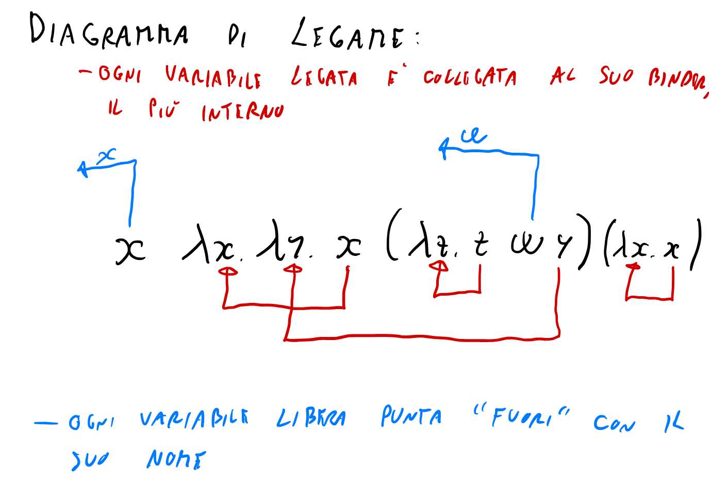

### Funzioni $n$-arie e Applicazione parziale

Una funzione binaria $f(x,y) = g(x,y)$ può essere vista come una funzione unaria che
restituisce una funzione unaria: $\lambda x.\lambda y.gxy$

Si osserva che $g(x,y)$ viene codificato con il passaggio sequenziale di due input (
funzioni unarie) $\to$ $gxy$ che equivale a $(gx)y$. Significa che è possibile
applicare le funzioni parzialmente. Ad esempio $(\lambda x.\lambda y.x+y)2$ riduce alla
funzione $\lambda y.2 + y$.

### Intuizione: Riduzione

Un $\lambda$-termine può ridurre a un altro $\lambda$-termine $t'$ rimpiazzando
una chiamata di funzione $(\lambda x.M)N$ con il corpo $M$ dove sostituisco $x$
con $N$.

Esempio: $(\lambda x.yx)(zz)$ riduce a $y(zz)$.

Una definizione rigorosa della nozione di sostituzione è fondamentale.

### Variabili libere e legate

$$t ::= x \mid tt \mid \lambda x.t $$
I nomi dati ai parametri formali non sono rilevanti nella definizione di una funzione:
$\lambda x.x$ è la stessa funzione di $\lambda y.y$

Ciò cambia con i nomi delle variabili globali: $\lambda x.y$ e $\lambda x.z$ sono due
programmi diversi. Intuitivamente è impossibile rimpiazzare l'uno con l'altro in un contesto dove $y = 0$ e $z = 1$ senza ottenere risultati diversi.

Nell'astrazione $\lambda x.t$, $\lambda$ viene detto **binder** poiché lega la
variabile $x$ al corpo $t$. Una variable non legata viene detta **libera**.
Le variabili legate sono parametri formali, quelle libere sono tutte variabili globali.

#### Definizione: insieme delle variabili libere

L'insieme delle variabili libere $\text{FV}(t)$ di $t$ si calcola come segue:

- $\text{FV}(x) = \{x\}$
- $\text{FV}(MN) = \text{FV}(M) \cup \text{FV}(N)$
- $\text{FV}(\lambda x.M) = \text{FV}(M) \setminus \{x\}$

Esempio: $\text{FV}(\lambda x.xy(\lambda y.yz)) = \{y, z\}$

### Definizione: $\alpha$-conversione $\equiv_{\alpha}$

Due $\lambda$-termini si dicono $\alpha$-convertibili ($t_1 \equiv_{\alpha} t_2$) se è
possibile ottenere l'uno dall'altro, effettuando una ridenominazione delle sole variabili
legate tale che le occorrenze legate di una variabile in posizione corrispondente nei due
termini siano legate dai binder in posizione corrispondente e che le occorrenze di variabili
libere abbiano in posizione corrispondente una variabile libera con lo stesso nome.

Più semplicemente sono due $\lambda$-termini che hanno il medesimo diagramma di legame.

Alcuni esempi:

- $\lambda x.\lambda y.xyz  \equiv_{\alpha} \lambda y.\lambda w.ywz$
- $\lambda x.\lambda y.xyz  \not\equiv_{\alpha} \lambda x.\lambda z.xzz$
- $\lambda x.\lambda y.xyz  \not\equiv_{\alpha} \lambda x.\lambda y.yxz$
- $\lambda x.\lambda y.xyz  \not\equiv_{\alpha} \lambda y.\lambda w.xyw$

**Attenzione!!** : termini $\alpha$-equivalenti saranno considerati uguali.
L'$\alpha$-equivalenza è una **classe di equivalenza**

Questa operazione consente di mantenere un diagramma di legame, evitando catture.

### Sostituzione

Quando si sostituisce in $M$ un termine $N$ al posto di una variabile $x$ ($M\{N/x\}$) occorre
prestare attenzione a non effettuare catture accidentali delle variabili libere.

Esempio:
$(\lambda x.xy)\{zz/y\} = \lambda x.x(zz)$ ma $(\lambda x.xy)\{xx/y\} \neq \lambda x.x(zz)$, questo
perché le $x$ a sinistra in $xx$ sono globali, ma a destra sono parametri formali (dx e sx di $\neq$)

La semantica è quindi errata. Per evitare questa problematica si usa $\alpha$-conversione $\to$ sempre
possibile grazie all'esistenza di infinite variabili.

Soluzione tramite $\alpha$-conversione:
$(\lambda x.xy)\{xx/y\} \equiv_{\alpha} (\lambda z.zy)\{xx/y\} = \lambda z.z(xx)$

Questo indica che spesso per poter sostituire, devo prima $\alpha$-convertire.

#### Definizione

$M\{N/x\}$ è definito come:

- $x\{N/x\} = N$
- $y\{N/x\} = y$
- $(t_1 t_2)\{N/x\} = t_1 \{N/x\}t_2 \{N/x\}$
- $(\lambda x.M)\{N/x\} = \lambda x.M$ $\to$ tutte le $x$ in $M$ sono legate, quindi non libere e non sostituibili.
- $(\lambda y.M)\{N/x\} = \lambda z.M\{z/y\}\{N/x\}$ per $z \not\in \text{FV}(M) \cup  \text{FV}(N)$

**Terminologia**: $z$ è **sufficientemente fresca** se $z \not\in \text{FV}(M) \cup \text{FV}(N)$ e **fresca** se non è mai stata
utilizzata prima. Ogni variabile fresca è anche sufficientemente fresca.

### Definizione: $\beta$-riduzione

$t_1  \beta$-riduce a $t_2$ **in un passo**
(Notazione: $t_1 \to_{\beta} t_2$) $\iff$ ottengo $t_2$ da $t_1$
rimpiazzando da qualche parte in $t_1$ il **redex** $(\lambda x.M)N$ con il suo
**ridotto** $M\{N/x\}$.

Esempio: $\lambda x(\lambda y.xy)x \to_{\beta} \lambda x.zz$ dove è stato
ridotto il _redex_ $(\lambda y.xy)x$

La definizione formale avviene tramite un sistema di inferenza, composto dalle seguenti regole:

$$
\dfrac{}{(\lambda x.M)N \to_{\beta} M\{N/x\}}
$$

$$
\dfrac{M \to_{\beta} M'}{MN \to_{\beta} M'N}
$$

$$
\dfrac{M \to_{\beta} M'}{NM \to_{\beta} NM'}
$$

$$
\dfrac{M \to_{\beta} M'}{\lambda x.M \to_{\beta} \lambda x.M'}
$$

L'ultima regola modifica il corpo a runtime $\to$ grossa differenza con linguaggi compilati $\to$ l'ottimizzazione
del codice avviene durante la compilazione. Il corpo di una funzione può essere ridotto prima dell'invocazione.

#### Definizione: $\beta$-riduzione in n passi

- $t \to_{\beta}^0 t$
- $t \to_{\beta}^{n + 1} t''$ sse $t \to_{\beta} t'$ e $t' \to_{\beta}^{n} t''$

#### Definizione: chiusura riflessiva e transitiva della $\beta$-riduzione

- $t \to_{\beta}^* t'$ $\iff$ $\exists  n. t \to_{\beta}^{n} t'$

### Forme normali

- $t$ **è una forma normale** ($t \not\to_{\beta}$) sse $\not\exists  t'.t \to_{\beta} t'$
- $t$ **ha una forma normale t'** sse $t \to_{\beta}^* t' \land t' \not\to_{\beta}$
- $t$ **ha una forma normale o può convergere** sse esiste un $t'$ tc $t$ ha forma normale $t'$.

### Non determinismo

La relazione $\to_{\beta}$ è **non deterministica**, ovvero ci sono dei $t$ tc esistono $t_1 , t_2$ distinti
tc $t_1 \; {}_{\!\beta}\!\leftarrow\; t \;\to_{\beta}\; t_2$

Strade diverse hanno lunghezze diverse, ma comunque **convergenti** $\to$ è una proprietà del $\lambda$-calcolo.

Questa proprietà è nota anche come **unicità della forma normale** e permette di
ignorare l'ordine di esecuzione delle due "strade". Questo introduce un vantaggio notevole,
infatti i linguaggi che non godono di questa proprietà e consentono di introdurre
_side effects_ durante la valutazione di un'espressione, possono dare origine a
comportamenti inattesi.

## Espressività del $\lambda$-calcolo

Turing completezza $\iff$ **tipi** di dato, **scelta**, **ripetizione**.

### Ricorsione nel $\lambda$-calcolo

Qui si ricorre alla logica per andare ad esplorare eventuali meccanismi che consentono di ottenere ragionamenti circolari (cicli).

#### Paradosso di Russell

Il $\lambda$-calcolo consente di ottenere il paradosso di Russell:

- predicato binario $\to$ applicazione
- è possibile fare auto-applicazione
- negazione tramite un $\lambda$-termine qualsiasi
- trasformazione di una proprietà (predicato) in un insieme auto-applicabile (assioma inconsistente di comprensione).
  $\to$ tramite binding della variable ($Y | Y\dots$ è un binding a tutti gli effetti).

$X = \{Y| (Y \not\in Y)\}$ $\to$ $\lambda Y.g(YY)$

La duplicazione YY consente quindi di avere un programma che duplica il suo codice.
Si ha quindi con $g$ funzione identità il più piccolo $\lambda$-termine divergente. Questo lascia aperta la
possibilità che il $\lambda$-calcolo sia Turing completo (**TH: linguaggio Turing completo è divergente**):

$$
(\lambda x.xx)(\lambda x.xx) \to_{\beta} (\lambda x.xx)(\lambda x.xx) \to_{\beta} \dots
$$

#### Divergenze

Un termine $t_0$ può divergere sse $\forall i. \exists   t_{i+1}.t_i \to_{\beta} t_{i+1}$
Un termine può divergere e convergere allo stesso tempo (per via del non determinismo).

### Punto fisso

Dato una funzione $f: A \to A$, $x \in A$ è un punto fisso di $f$ se $f(x) = x$.
Esistono funzioni che non ammettono punti fissi, tuttavia non è così nel $\lambda$-calcolo.

### Punto fisso in $\lambda$-calcolo

Un $\lambda$-termine $t$ è un punto fisso per $f$ se $ft =_{\beta} t$ dove $=_{\beta}$ è la chiusura simmetrica, riflessiva e
transitiva di $\to_{\beta}$.

I punti fissi esistono sempre: $(\lambda x.f(xx))(\lambda x.f(xx))$ è un punto fisso di $f$.

Questo risultato è dato dalla divergenza che in matematica non esiste, in quanto non si ha il concetto di calcolo.
Intuitivamente si ha perché un "termine divergente + 1" rimane un termine divergente.

### Operatore di punto fisso

Un $\lambda$-termine $Y$ è un **operatore di punto fisso** sse per ogni $\lambda$-termine $f$, $Yf$ è un punto fisso di
$f$. Si ha quindi un programma universale che dato un termine, ne calcola il punto fisso.

Esempio: $\lambda f.((\lambda x.f(xx))(\lambda x.f(xx)))$.
La presenza di questo operatore è ciò che consente di codificare la ricorsione.

## Codifica delle funzioni ricorsive

Le funzioni ricorsive esplicite non esistono in $\lambda$-calcolo, perciò si trasforma una funzione ricorsiva
in un **funtore non ricorsivo**, utilizzando il punto fisso di questo funtore.

**Metodo per realizzare ricorsione in $\lambda$-calcolo**: prendo la definizione ricorsiva, aggiungo $\lambda f$
davanti (nome funzione) e passo tutto in input a un operatore di punto fisso.

Esempio fattoriale:

$$
\begin{aligned}
&\text{let fact} = \\
&\lambda n. \\
&\quad \text{match } n \text{ with} \\
&\quad \mid 0 \to (S 0) \\
&\quad \mid (S m) \to (S m) \cdot \text{fact}(m)
\end{aligned}
$$

diventa:

$$
\begin{aligned}
&\text{let fact} = \\
&Y \\
&\quad (\lambda \text{fact}. \\
&\quad\quad \lambda n. \\
&\quad\quad\quad \text{match }  n \text{ with} \\
&\quad\quad\quad \mid 0 \to (S 0) \\
&\quad\quad\quad \mid (S m) \to (S m) \cdot \text{fact}(m))
\end{aligned}
$$

Si ottiene la ricorsione tramite duplicazione del codice.
La codifica semplice della circolarità tramite ricorsione, mostra ulteriormente la natura funzionale del $\lambda$-calcolo.

#### Esempio di invocazione

Considero

$$
F = (\lambda \text{fact}. \lambda n. \text{match } n \text{ with } \mid 0 \to (S 0) \mid (S m) \to (S m) \cdot \text{fact}(m))
$$

Applico l'operatore di **punto fisso**:

$$
\begin{aligned}
& \text{fact } 4 \equiv (Y F) 4 \equiv (\lambda f.((\lambda x.f(xx))(\lambda x.f(xx))) F) 4 \\
& \to_{\beta} ((\lambda x.F(xx))(\lambda x.F(xx))) 4 \\
& \to_{\beta} (F((\lambda x.F(xx))(\lambda x.F(xx)))) 4 \equiv (F(YF)) 4
\end{aligned}
$$

Proseguo con le $\beta$-riduzioni.

$$
\begin{aligned}
& (F(YF)) 4 \equiv ((\lambda \text{fact}. \lambda n. \text{match } n \text{ with } \cdots)(YF))4\\
& \to_{\beta}  (\lambda n. \text{match } n \text{ with }  \\
& \quad \quad \quad \mid 0 \to (S 0)\\
& \quad \quad \quad \mid (S m) \to (S m) \cdot YF(m))4 \\
& \to_{\beta}   \text{match 4 with }  \\
& \quad \quad \quad \mid 0 \to (S 0)\\
& \quad \quad \quad \mid (S m) \to (S m) \cdot YF(m) \\
& = 4 \cdot (YF)(3)  \\
& = 4 \cdot 3 \cdot  (YF)(2)  \\
& = 4 \cdot 3 \cdot 2 \cdot  (YF)(1)  \\
& = 4 \cdot 3 \cdot 2 \cdot  1  \\
& = 24   \\
\end{aligned}
$$

## Tipi di dato algebrici

Alcuni: esempi:

$$
\text{type B} = \text{true: B} \mid \text{false: B}
$$

$$
\text{type N} = \text{0: N} \mid \text{S: N} \to \text{N}
$$

$\text{S}$ è la funzione "successore" che prende in input un numero $n$ e restituisce il successore di $n$.

<!-- In realtà non è una funzione vera e propria. -->

$$
\text{type List T} = \text{[]: List T} \mid \text{(::) : T} \to \text{List T} \to \text{List T}
$$

($(::)$ è la testa della lista)

$$
\text{type Seed} = \text{Hearts: Seed} \mid \text{Clubs: Seed} \mid \text{Flowers: Seed} \mid \text{Pikes: Seed}
$$

Gli elementi di un tipo algebrico sono tutti distinti.

$$
\text{type Option\_N} = \text{None: Option\_N} \mid \text{Some: N} \to \text{Option\_N}
$$

Tipo di dato algebrico che codifica un albero, in cui il tipo delle foglie differisce da quello dei nodi non foglia.

$$
\text{type Tree K V} = \text{Node: K} \to \text{Tree K V} \to \text{Tree K V} \to \text{Tree K V} \mid \text{Leaf: V} \to \text{Tree K V}
$$

### Costrutto di Pattern Matching

Esempio: funzione dato un albero di tipo Tree, vuole sommare tutti i numeri presenti nell'albero.

$$
\begin{aligned}
&\text{let rec sum: Tree Z Z} \to \text{Z} = \\
&\lambda t. \\
&\quad \text{match t with} \\
&\quad \mid \text{Leaf n} \to n \\
&\quad \mid \text{Node (k, t1, t2)} \to k + \text{sum t1} + \text{sum t2}
\end{aligned}
$$

In questo caso "match" è l'operatore di pattern matching, serve per rilevare se l'istanza corrente dell'abero è nodo o foglia.
Il pattern matching è possibile con i tipi di dato algebrici in quanto, ogni elemento del tipo di dato ha una forma **distinta**.
Ogni ramo dell'operatore "match" è un **pattern**.

Si vuole andare a codificare i tipi algebrici nel $\lambda$-calcolo, per poi andare ad implementare un operatore di pattern
matching che consenta di usare questi tipi. Infine serve dimostrare e verificare la correttezza del tutto.

## $\lambda$-calcolo: implementazione dei tipi algebrici tramite funzioni

### Tipo di dato astratto

Si tratta di un tipo, per cui mi aspetto di avere il tipo stesso e delle precise operazioni. Esempio con stack:

$$
\begin{aligned}
&\text{type S} \\
&\quad \text{Empty: ()} \to \text{S} \\
&\quad \text{Push: S} \to \text{K} \to \text{S} \\
&\quad \text{Pop: S} \to \text{K} \times \text{S}
\end{aligned}
$$

In questa definizione, ho solo la firma dei metodi associati al tipo, ma non ho alcuna implementazione che conferisca semantica.
Prima dell'implementazione occorre dare dei vincoli per un corretto funzionamento delle funzioni, ciò avviene tramite equazioni.
L'idea di funzione sembra alla base del tipo di dato astratto, quindi si può provare ad utilizzare le funzioni stesse
per dare anche l'implementazione.

### 1. Codifica di ogni AlgDT con un ADT

Esempio: "not" su booleani

$$
\begin{aligned}
&\text{() è i tipo unit} \\
& \\
&\text{ADT B} \\
&\quad \text{true: ()} \to \text{B} \\
&\quad \text{false: ()} \to \text{B} \\
&\quad \text{match: } \forall T. B \to T \to T \to T \quad \text{dove T è tipo polimorfo} \\
& \\
&\text{let not =} \\
&\lambda b. \\
&\quad \text{match } b \text{ with} \\
&\quad \mid \text{True} \to \text{False} \\
&\quad \mid \text{False} \to \text{True}
\end{aligned}
$$

Equazioni di correttezza su ADT B:

$$
\text{match (true()) t f} \to_{\beta}^* \text{t} \\
\text{match (false()) t f} \to_{\beta}^* \text{f}
$$

Codice "not" in $\lambda$-calcolo:

$$
\text{not} = \lambda \text{b. match b (false()) (true())}
$$

Invocazione:

$$
\text{not true}
$$

Esempio: AlgDT Tree K V

$$
\begin{aligned}
&\text{ADT Tree K V} \\
&\quad \text{leaf: V} \to \text{Tree K V} \\
&\quad \text{node: K} \to \text{Tree K V} \to \text{Tree K V} \to \text{Tree K V} \\
&\quad \text{match: } \forall T. \text{Tree K V} \to \\
&\qquad (\text{K} \to \text{Tree K V} \to \text{Tree K V} \to \text{T}) \to \quad \text{(pattern matching nodo)} \\
&\qquad (\text{V} \to \text{T}) \to \quad \text{(pattern matching foglia)} \\
&\qquad \text{T} \quad \text{(tipo di ritorno)}
\end{aligned}
$$

Equazioni di correttezza su ADT Tree K V:

$$
\text{match}_{\text{Tree}} (\text{Node } \text{K } \text{T}_{1} \text{ T}_{2}) (\lambda \text{k}. \lambda \text{t}_{1} . \lambda \text{t}_{2}. \text{n})
(\lambda \text{v.l}) \to_{\beta}^* (\lambda \text{k}. \lambda \text{t}_{1}. \lambda \text{t}_{2} . \lambda{n}) \text{K T1 T2 } \\
$$

L'equazione soprastante è un caso specifico della generalizzazione seguente:

$$
\text{match}_{\text{Tree}} (\text{Node } \text{K } \text{T}_{1} \text{ T}_{2}) \text{ n l} \to_{\beta}^* \text{n K T1 T2 } \\
$$

$$
\text{match}_{\text{Tree}} (\text{Leaf V}) \text{ n l} \to_{\beta}^* \text{l V} \\
$$

Codice "sum" in $\lambda$-calcolo (con zucchero sintattico):

$$
\text{let rec sum} = \lambda t. \text{match}_{\text{Tree}} \text{ t } (\lambda k. \lambda \text{t}_1 .\lambda \text{t}_2. \text{k} + \text{sum t1 + sum t2}) \text{ }(\lambda \text{v.v})
$$

Invocazione:

$$
\text{sum} \text{ Node } \text{K } \text{T}_{1} \text{ T}_{2}
$$

### 2. Implementazione dell'ADT

La funzione "match" viene implementata tramite la funzione identità ($\lambda x.x$).

Esempio con booleani:

$$
\begin{aligned}
& \text{() è il tipo unit} \\
& \\
& \text{ADT B} \\
& \quad \text{true: ()} \to \text{B} \\
& \quad \text{false: ()} \to \text{B} \\
& \quad \text{match: } \forall T. B \to T \to T \to T \quad \text{dove T è tipo polimorfo}
\end{aligned}
$$

$$\forall T. B \to T \to T \to T \equiv B \to (\forall T.T \to T \to T)$$

Dal momento che voglio implementare pattern matching tramite identità, il tipo dei booleani sarà definito come segue:
$$\text{B} = \forall T. T \to T \to T$$

I valori True e False, avranno le seguenti forme:
$$\text{true}: \forall T.T \to T \to T$$
$$\text{false}: \forall T.T \to T \to T$$

Dal momento che l'operatore di pattern matching sarà implementatato con l'identità, ci si aspetta il seguente comportamento:
$$\text{match}_{\text{B}} \text{ true t f} \to_{\beta} \text{ true t f} \to_{\beta}^* t$$
$$\text{match}_{\text{B}} \text{ false t f} \to_{\beta} \text{ false t f} \to_{\beta}^* f$$

Costruzione dei valori True e False con sole funzioni in $\lambda$-calcolo:
$$\text{true} = \lambda t. \lambda f. t$$
$$\text{false} = \lambda t. \lambda f. f$$

Andando a $\beta$-ridurre, si nota come con le implementatazioni fornite per i booleani e il pattern matching come identità, si ottenga il
comportamento corretto da parte dell'operatore di pattern matching:

$$
\text{match}_{\text{B}} \text{ true t f} = (\lambda x.x) (\lambda t.\lambda f. t)tf \to_{\beta} (\lambda t. \lambda f.t) tf \to_{\beta}
(\lambda f.t)f \to_{\beta} t
$$

$$
\text{match}_{\text{B}} \text{ false t f} = (\lambda x.x) (\lambda t.\lambda f. f)tf \to_{\beta} (\lambda t. \lambda f.f) tf \to_{\beta}
(\lambda f.f)f \to_{\beta} f
$$

True e False non sono più dati passivi, ma sono l'implementazione del costrutto if-then-else.
Il dato diventa la risposta all'osservazione del dato stesso $\to$ non è il pattern matching che effettua la decisione, è il tipo.

### Implementazione per il tipo Tree

La definizione seguente del tipo Tree è data dal fatto che anche per questo tipo di dato implementiamo il pattern matching come funzione identità.

$$
\text{Tree K V} =\forall \text{T}. (\text{K} \to \text{Tree K V} \to \text{Tree K V} \to \text{T}) \to (\text{V} \to \text{T}) \to \text{T}
$$

Un albero è qualcosa che posso interrogare per dirgli "esegui questa cosa se sei un nodo o esegui l'altra se sei una foglia".

I valori avranno quindi la seguente forma:

$$
\text{Node}= \lambda k. \lambda t_1. \lambda t_2. \lambda n. \lambda l. n k t_1 t_2
$$

I primi tre elementi sono l'input al costruttore di un nodo.
Andiamo a $\beta$-ridurre per osservare come l'implementazione del pattern matching tramite funzione idenità consente di ottenere
il comportamento atteso.

$$
\begin{aligned}
& \text{match}_{\text{Tree}} (\text{node } \text{K } \text{T}_1 \text{ T}_2) \text{ N L} \to_{\beta} \\
& (\lambda x.x)((\lambda k. \lambda t_1. \lambda t_2. \lambda n. \lambda l.n k t_1 t_2) \text{ K } \text{T}_1 \text{ T}_2) \text{ N L} \to_{\beta} \\
& ((\lambda k. \lambda t_1. \lambda t_2. \lambda n. \lambda l.n k t_1 t_2) \text{ K } \text{T}_1 \text{ T}_2) \text{ N L} \to_{\beta} \\
& (\lambda n. \lambda l.n \text{K} \text{ T}_1 \text{ T}_2) \text{ N L} \to_{\beta} \\
& \text{N } \text{K } \text{T}_1 \text{ T}_2
\end{aligned}
$$

$$
\text{Leaf}: \forall \text{T}. \text{V} \to \text{T}
$$

$$
\text{Leaf}= \lambda v.\lambda n.\lambda l.lv
$$

Pattern matching nel caso foglia:

$$
\begin{aligned}
& \text{match}_{\text{Tree}} (\text{leaf } \text{V}) \text{ N L} \to_{\beta} \\
& (\lambda x.x)((\lambda v.\lambda n.\lambda l.lv) \text{V}) \text{ N L} \to_{\beta} \\
& ((\lambda v.\lambda n.\lambda l.lv) \text{V}) \text{ N L} \to_{\beta} \\
& (\lambda n.\lambda l.l \text{V}) \text{ N L} \to_{\beta} \\
& (\lambda n.\lambda l.l \text{V}) \text{ N L} \to_{\beta} \\
& (\lambda l.l \text{V}) \text{ L} \to_{\beta} \\
& (\lambda l.l \text{V}) \text{ L} \to_{\beta} \\
& \text{L V}
\end{aligned}
$$

### Implementazione per i naturali

Definizione del tipo associato ai numeri naturali:

$$
\text{Type }N = 0: N \mid S: N \to N
$$

L'operatore di pattern matching rimane $\lambda x.x$, mentre gli elementi del tipo sono definiti come segue:

$$
0 = \lambda o.\lambda s. o
$$

$$
S = \lambda n.\lambda o.\lambda s. sn
$$

Le codifiche soprastanti dei tipi di dato algebrici seguono la codifica di Scott, che è una codifica più generale e
semplice della codifica dei tipi di dato induttivi. La complessità computazionale è la medesima, tuttavia la codifica
di Scott richiede di essere combinata con la ricorsione

$$ \text{Ind} \subseteq \text{AlgDT}, \quad \text{Coind} \subseteq \text{AlgDT}, \quad \text{Coind} \cap \text{Ind} \neq \varnothing $$

I booleani $\in \text{Coind} \cap \text{Ind}$ in quanto non ricorsivi. I coinduttivi sono tipi infiniti, utili per
processi che non terminano mai e ricevono degli input.

## Richiami di teoria degli insiemi

$$
A \times B = \{\langle a,b \rangle \mid a \in A, b \in B\}
$$

$$
A \times B = \{\langle t,x \rangle \mid t = \text{R } \land x \in B \text{ } \lor t = \text{L } \land x \in A\}
$$

$$
\emptyset = \{\}
$$

$$
\mathbb{1} = \{a\}
$$

Si nota che è possibile andare a definire i tipi considerandoli degli insiemi. Alcuni esempi:

- #### Tipo Tree

  $$
  \text{type Tree K V} = \text{Node: K} \to \text{Tree K V} \to \text{Tree K V} \to \text{Tree K V} \mid \text{Leaf: V} \to \text{Tree K V}
  $$

  Utilizzando gli insiemi ottengo:

  $$
  \text{type Tree K V} = \text{Node: K} \times \text{Tree K V} \times \text{Tree K V} \times \text{Tree K V} \mid \text{Leaf: V} \times \text{Tree K V}
  $$

  che diventa:

  $$
  \text{type Tree K V} = \text{K} \times \text{Tree K V} \times \text{Tree K V} + \text{V}
  $$

- #### Tipo N

  Analogamente con i naturali:

  $$
  \text{type N} = 1 + \text{N}
  $$

I tipi di dato algebrici prendono la forma
$$ \text{type A} = \sum \prod \text{T}$$
dove $\text{T}$ è un tipo generico. Su questo tipo di definizione di tipi, valgono tutte le operazioni algebriche
classiche, che possono essere sfruttate dal compilatore per effettuare delle ottimizzazioni. Si può anche calcolare
operazioni più complesse quali integrali e derivate.

Un esempio di "derivate" è dato dagli iteratori.
Consdero il tipo lista: $\text{L} = 1 + \text{V} \times \text{L}$ dove $1$ è la lista vuota,
$\text{V}$ è la testa e $\text{L}$ è il resto della lista.
Provo a calcolare la derivata di questo tipo rispetto al tipo degli elemeti $\text{V}$

$$
\begin{aligned}
& \frac{\mathrm{d} L_V}{\mathrm{d}V} = 0 + \frac{\mathrm{d} V}{\mathrm{d}V} \times L_V + \frac{\mathrm{d} L_V}{\mathrm{d}V} \times V \\
& \quad \quad  = L_V + V\frac{\mathrm{d} L_V}{\mathrm{d}V}
\end{aligned} \\
$$

Essendo il tipo ricorsivo, anche la sua derivata è correttamente ricorsiva. Il tipo ottenuto ha la seguente forma:

$$
\text{type Zipper} = \text{Future}: \text{L}_\text{V} \to \text{Zipper} \mid \text{Past}: \text{V} \to
\text{Zipper} \to \text{Zipper}
$$

La definizione del tipo iteratore tramite derivazione del tipo lista consente di ottenere il tipo "lista con un buco
in qualche punto", che è esattamente ciò che si può notare dalla definizione di $\text{Zipper}$.

## Codifica dei principali costrutti tramite $\lambda$-calcolo

### Codifica di variabili mutabili

```
var x = 4
f() { x = x + 1; 2}
g(y) { x = x + y;}

main() {
    var z = f()
    g(z)
    x
}
```

Si vuole tradurre lo pseudocodice soprastante in $\lambda$-calcolo. Sapendo che ho a disposizione solamente delle
funzioni, qualsiasi cosa che viene letta dovrà essere presa in input da qualche funzione e, analogamente, qualsiasi
cosa che viene scritta dovrà essere output di una qualche funzione.

Dal momento che la funzione $f$ ritorna un valore e ne modifica un altro, dovrà ritornare due valori in output: si
utizza un coppia, che è codificabile in $\lambda$-calcolo.

$$
f = \lambda x. \langle x + 1, 2 \rangle
$$

$$
g = \lambda x. \lambda y. x + y
$$

$$
\begin{aligned}
& main = \lambda x.( \\
& \quad \quad \text{let }\langle x', z \rangle = f x \text{ in} \\
& \quad \quad \text{let } x'' = g x' z \text{ in} \\
& \quad \quad x '' \\
& )
\end{aligned}
$$

$$
main \text{ 4}
$$

Le variabili sono utilizzate sempre una sola volta $\to$ le funzioni sono isolabili $\to$ maggiore facilità nel
testing dei programmi.

### Codifica del tipo coppia

$$
\text{type } A \times B = \langle \quad, \quad \rangle : A \to B \to A \times B
$$

Pattern matching per il tipo coppia:

$$
\begin{aligned}
& \text{match } E \text{ with} \\
& \mid \langle x,y \rangle \to C
\end{aligned}
$$

Che è letteralmente `let <x,y> = E in C`.

### Codifica operatore `let in`

Sintassi di base dell'operatore `let in`: `let x = E in F`, che si legge: "valuto E, chiamo il risultato x che può
essere usato in F". In $\lambda$-calcolo: $(\lambda x.\text{F})\text{E}$

### Codifica operatore `for`

```
var n = 5
var tot = 0

for var i = 0; i <= n; do
    tot =  tot + i
end
tot
```

Definisco l'operatore `for` tramite ricorsione.

$$
\begin{aligned}
& \text{let rec for}  = Y(\lambda \text{for}.\lambda \text{tot}. \lambda i. \lambda n. \\
& \quad \text{match} (i \leq n) (\text{for} (\text{tot} + i) (i+1) n) \text{ tot} \\
& ) \\
& \text{for 0 0 5} \\
& \\
& \text{dove } Y =  \lambda f.(\lambda x.f(xx)) (\lambda x.f(xx)) \\
& \text{dove } + \text{ e } \leq \text{ sono definiti per ricorsione sui naturali} \\
\end{aligned}
$$

### Codifica operatore `while`

```
fn sum(n) {
  tot = 0
  while (n > 0) {
    tot = tot + n;
    n = n - 1;
  }
  tot
}
```

Definisco l'operatore `while` tramite ricorsione.

$$
\begin{aligned}
& \text{let rec while} = Y(\lambda \text{while}. \lambda n. \lambda tot . \\
& \text{match} (n > 0) (tot) (\text{while}(tot+n)(n-1)) \\
& \\
& \text{let sum} = \lambda n. \text{while  } n \quad  0 \\
& \\
& \text{sum} \\
\end{aligned}
$$

### Codifica assegnamento di campi nello heap

Si considera un esempio con alberi binari di ricerca, dove le foglie sono stringhe.
Aggiorno le foglie con l'operazione `update(k, v)` dove $k$ è la chiave intera e  
$v$ è il nuovo valore per la foglia.

Nei linguaggi funzionale deve valere l'**immutabilità**, segue che non è possibile
modificare direttamente la cella di memoria $\to$ posso sfruttare questa proprietà
per ridurre il costo della copia dell'intera struttura dati $\to$ vado a **modificare
i puntatori** della nuova copia dell'albero affinché puntino ai dati dell'albero
precedente che possono essere **riusati**.

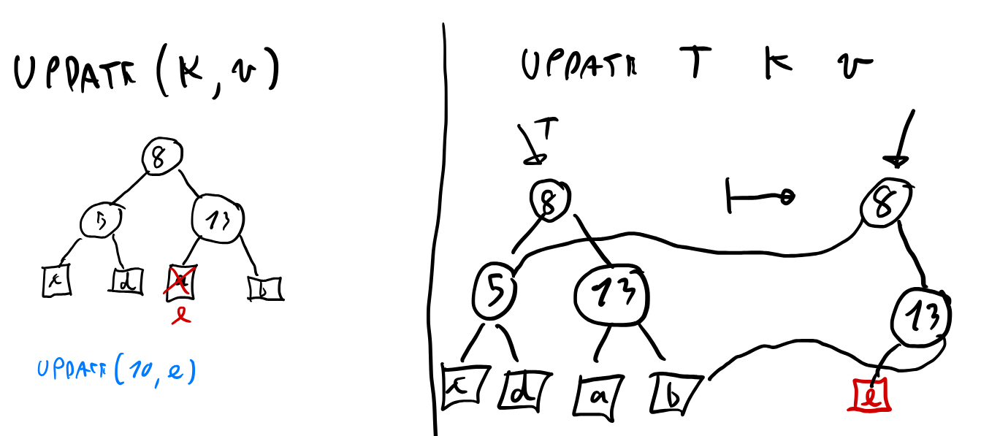

#### Stima costo computazionale

|        | Funzionale  | Imperativo  |
| ------ | ----------- | ----------- |
| Spazio | $O(\log n)$ | $O(1)$      |
| Tempo  | $O(\log n)$ | $O(\log n)$ |

Ricopio solo il cammino interessato dalla modifica $\to$ costo logaritmico.
La codifica in $\lambda$-calcolo non si interessa della gestione dei puntatori
$\to$ classica implementazione ricorsiva.

### Codifica oggetti

Esistono due tipologie di oggetti: **class-based** e **object-based**, con i primi che sono un caso particolare dei
secondi. Essendo gli oggetti raccolte di dati differenti, possono essere implementati come tuple, similarmente a
come sono state definite le coppie in precedenza.

Si consideri il seguente frammento di pseudocodice che codifica un oggetto:

```
object:
    var x = 4
    method f = g x
    method g = \\y.y
    method powerUp =
        x = x + 1
        g = \\y.y+y
```

Il codice in $\lambda$-calcolo ha il seguente aspetto:

$$
\begin{aligned}
& \langle 4, \\
& (\lambda self. self.g \quad self \quad self.x), \\
& (\lambda self. \lambda y. \langle self, y \rangle), \\
& (\lambda self. \langle self.x + 1,self.f, \lambda self. \lambda y. \langle self, y+y \rangle, self.powerUp  \rangle) \\
& \rangle \\
\end{aligned}
$$

L'oggetto consiste quindi in una tupla, avente la seguente firma:

$$
\text{type } A \times B \times C \times D = \langle \quad ,\quad,\quad,\quad \rangle: A \to B \to C \to D \to A \times B \times C \times D
$$

Le operazioni di accesso ai campi sono semplicemente dei pattern matching:

$$
.g = \lambda r. \text{match } r \text{ with } \langle \text{x,f,g,pu} \rangle \implies g
$$

### Operatori di controllo

Si tratta di un operatore che cambia il classico flusso di controllo regolato dallo
stack. Alcuni esempi sono: `goto`, `break`, `continue`, `catch`, `throw`, `abort`,
`yield`. Il cambiamento del controllo è sia spaziale che temporale.
Non è ben precisato quale sarà il destino del flusso iniziale che il controllo avrebbe
dovuto seguire, potrebbe essere eliminato o ripreso successivamente $\to$ varia in
base all'operatore.

Questa tipologia di operatori viene implementata a basso livello come una serie di
manipolatori dello stack.

Altri operatori di controllo sono i cosiddeti "interrupt self-inflicted", che non sono
altro che le syscall al sistema operativo.

Implementare questa tipologia in operatori in $\lambda$-calcolo è complesso, in quanto
si tratta di un linguaggio puramente funzionale, in cui non esistono gli operatori di
controllo primitivi.

#### Codifica di un operatore di controllo: eccezioni

La codifica di un operatore di controllo significa avere la possibilità di aggiungere
la disgiunzione nella firma di una funzione in $\lambda$-calcolo.
Tuttavia ciò non è realizzabile in $\lambda$-calcolo, di conseguenza si ricorre
alla logica per cercare una soluzione.

$$
\begin{aligned}
& C \implies A \lor B \equiv \\
& C \implies \neg (\neg A \land \neg B) \\
& C \implies ((A \implies \bot) \land (B \implies \bot)) \implies \bot \\
& C \implies (A \implies \bot) \land (B \implies \bot) \implies \bot \\
& \quad \quad \quad \quad \quad  \text{da cui segue} \\
& C \implies (A \implies \bot) \implies (B \implies \bot) \implies \bot \\
\end{aligned}
$$

Quest'ultima formula può essere codificata in $\lambda$-calcolo.

## Dinamica del $\lambda$-calcolo

Per studiare la dinamica del $\lambda$-calcolo introduciamo i **sistemi astratti di riscrittura (ARS)**.

Un ARS è una coppia $(A, \to)$:

- $A$ è un insieme non vuoto di stati
- $\to$ è detto **passo di riscrittura** ed è una relazione su $A$.

Il $\lambda$-calcolo è un esempio di ARS $\to$ $(\Lambda, \to_{\beta})$.

### Definizioni

- $s$ è una **forma normale** sse $s \nrightarrow$.
- $s$ ha **forma normale** sse $\exists  s' \text{ tc } s \to^* s'$ e $s'$ è una **forma normale**.
  Significa che $s$ può convergere e viene detto **debolmente normalizzante**.
- $s$ è **fortemente normalizzante** sse $\nexists (s_i)_{i \in \mathbb{N}} \quad \forall i. s_i \to s_{i+1}$.
- $s$ è **deterministico** sse $\forall s_1 , s_2. s_1 \leftarrow s \to s_2 \implies s_1 = s_2$.

### Considerazioni (sulle definizioni)

1. fortemente normalizzante $\implies$ debolmente normalizzante
2. $s$ deterministico $\nRightarrow$ s ha forma normale.
3. se $\to$ non ha stati normalizzanti **non è interessante**. $\forall s. s$ è deterministico, ma
   divergente (ovvero non debolmente normalizzante).

4. se $s$ non è deterministico, è possibile avere **forme normali diverse** $\to$ non è cosa buona $\to$
   stesso input, ma possibili output differenti.

5. se $s$ ha forma normale $s'$, può capitare che $s \to s'' \nrightarrow s'$
6. $s$ potrebbe essere **debolmente normalizzante** e ammettere un **cammino divergente** $\to$ non è **fortemente
   normalizzante**.

I punti 4 e 5 **non** possono accadere in $\lambda$-calcolo. Il punto 6 invece può verificarsi, ma posso
sempre smettere di divergere.

### Confluenza

Può essere vista come una proprietà che mitiga il non determinismo di un ARS.

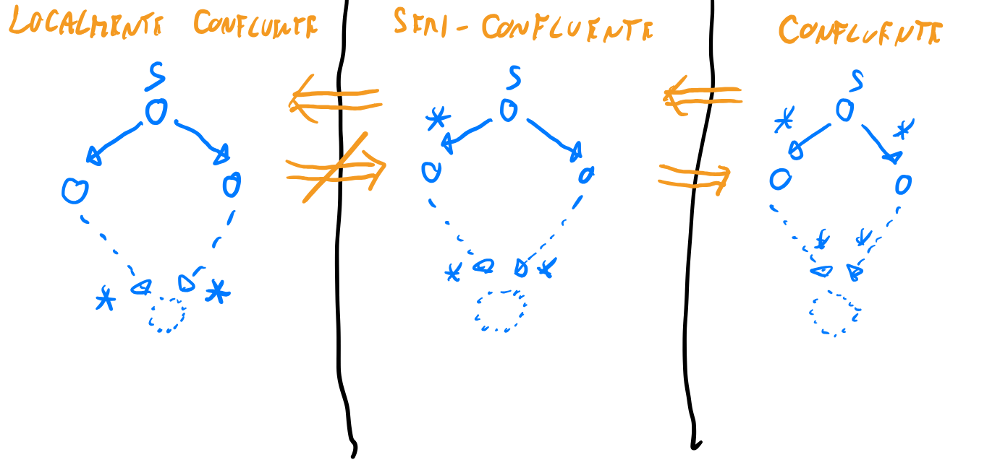

#### Meta-Definizione

Un ARS $(A, \to)$ ha la proprietà $P$ quando ogni $s \in A$ gode di $P$.

#### Confluenza locale $\nRightarrow$ Semi-confluenza


Sull'osservazione: localmente confluente + fortemente normalizzante $\implies$ semi-confluente.

#### Strip Lemma

Dato un ARS semi-confluente, esso è confluente.

La dimostrazione procede per induzione su $n$ che è il numero di passi di $\to$ nel secondo cammino,
partendo da $s$ nel caso confluente.

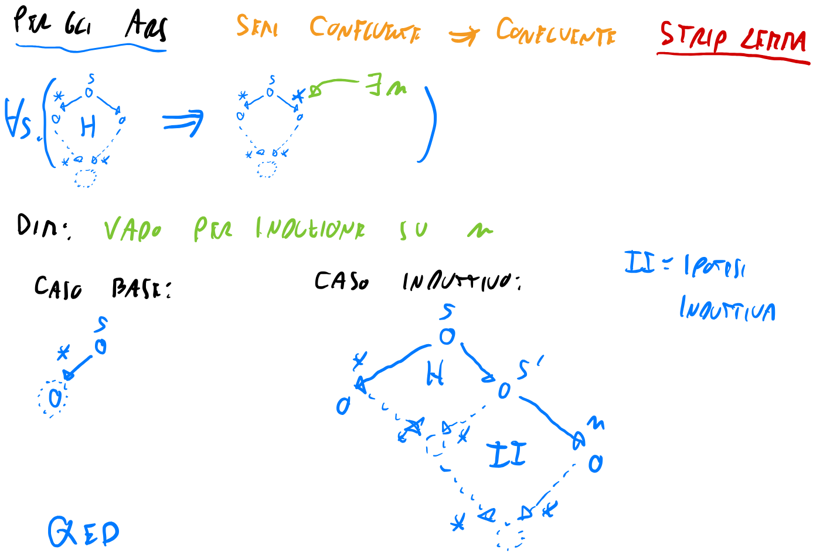

Riesco a _chiudere_ il parallelogramma in quanto ho applicato la confluenza locale $s$,
l'ipotesi mi dice che è semi-confluente $\implies$ localmente confluente.

#### Teorema: confluenza $\implies$ unicità delle forme normali

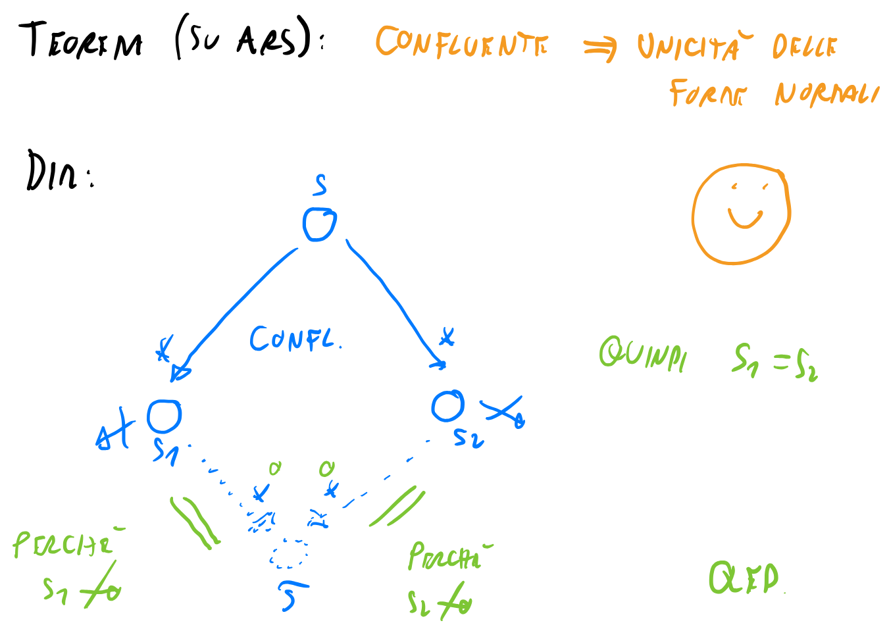

**Idea**: se raggiugo due forme normali, queste devono coincidere: per confluenza devo potermi ricongiungere
dopo averle raggiunte, ma sono forme normali quindi da esse non posso muovermi $\to$ mi ricongiungo in 0 passi
$\to$ coincidono.

#### Teorema: confluenza $\implies$ safety

$\forall s.$ $s$ confluente $\land$ $s$ ha forma normale $\implies$ ($\forall s'. s \to^* s' \implies$ $s'$
ha forma normale).

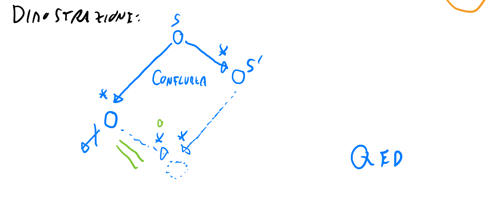

**Tip per capire**: se $s$ ha forma normale, allora ha un cammino che lo porta alla forma normale, applico confluenza
a questo cammino e al cammino che da $s$ va in $s'$.

##### Esempi in $\lambda$-calcolo

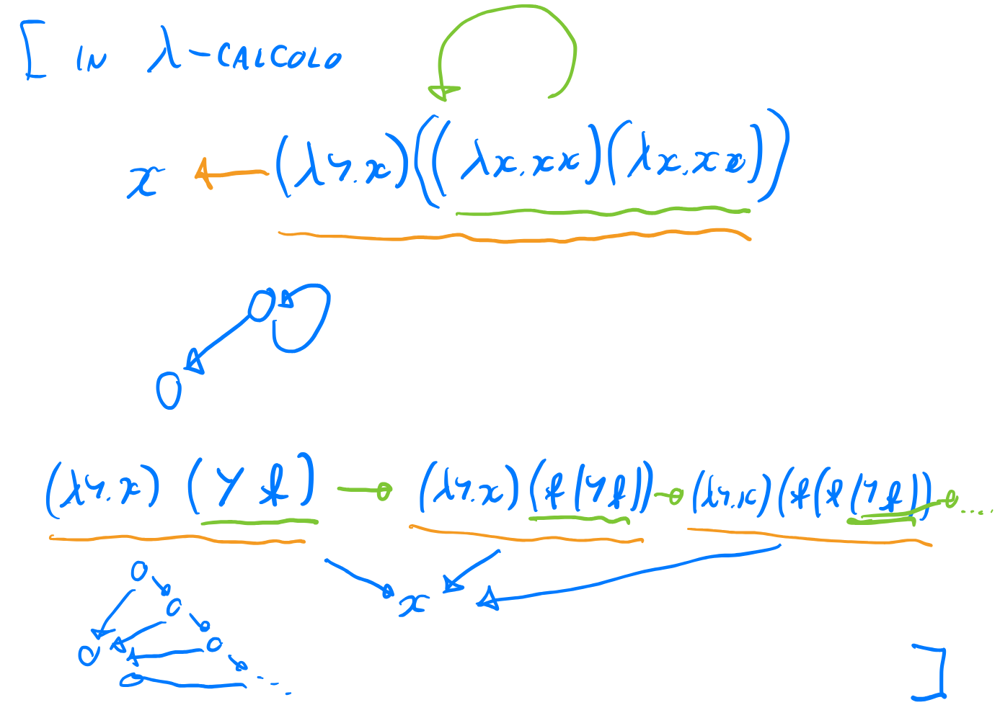

#### Non-determinismo in $\lambda$-calcolo

L'unica causa di non-determismo risiede nella **scelta** del redex da ridurre. Sono possibili varie casistiche:

1. **Redex disgiunti**

   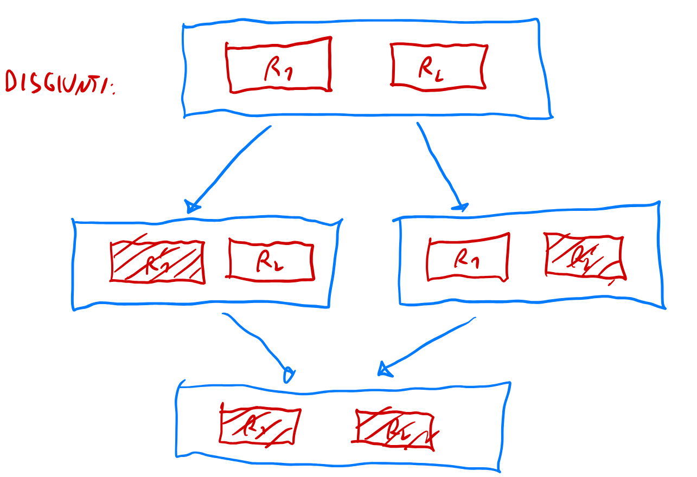

   Si tratta di una forma di confluenza molto forte in cui in un passo divergo e in un altro richiudo.

   Esempio: $x((\lambda y.y)z)((\lambda w.w)u)$

2. **Redex parzialmente sovrapposti** $\to$ **non esiste** in $\lambda$-calcolo.

   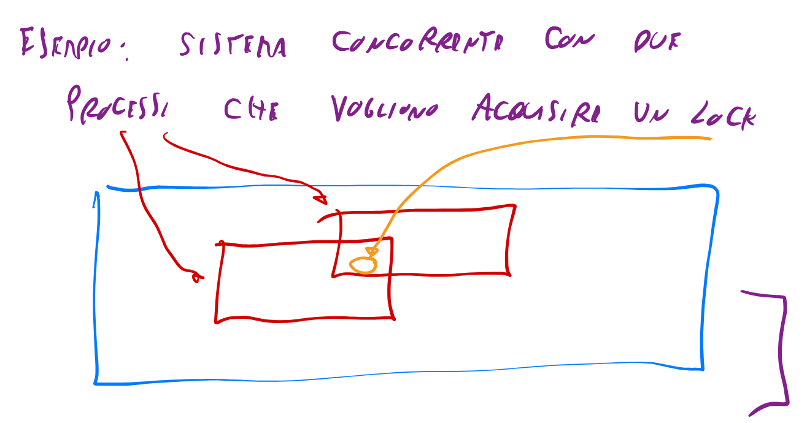

3. **Redex imbricati** (uno dentro l'altro)

   Generalmente uno dei due redex andrebbe distrutto, tuttavia, non è cosi in $\lambda$-calcolo.

   Qui abbiamo due sottocasi:
   - Redex imbricato nell'**argomento** della $\lambda$-astrazione

     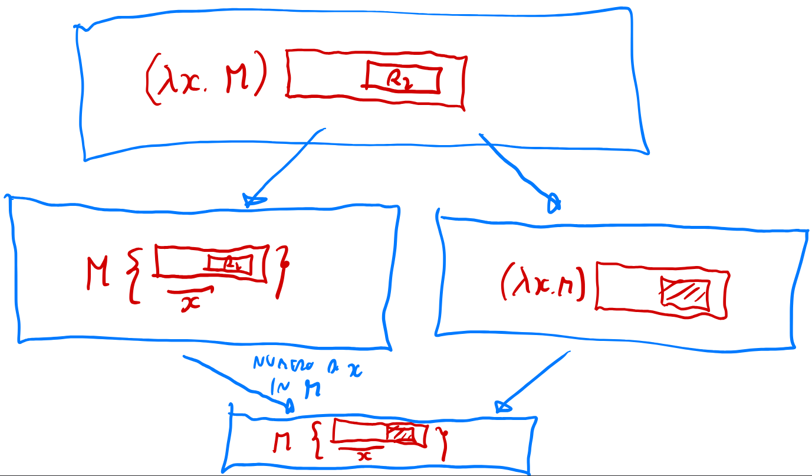
     - Il ramo di sinistra mostra un valutazione **lazy (call-by-name)**, ciò porta alle seguenti osservazioni:
       1. side effect eseguiti più volte (a ogni sostituzione) $\to$ svantaggio
       2. rischio valutazione tante volte dell'argomento $\to$ svantaggio, ma ottimizzabile con memoizzazione
          (**call-by-mid**) $\to$ spesso l'overhead per l'ottimizzazione peggiora le performance $\to$ poco usato.
       3. se l'argomento non viene usato $\to$ non lo valuto $\to$ vantaggio
     - Il ramo di destra mostra un valutazione **call-by-value**, ciò porta alle seguenti osservazioni:
       1. side effect eseguiti una sola volta $\to$ vantaggio
       2. argomento valutato solo 1 volta $\to$ vantaggio
       3. se l'argomento non viene usato, lo riduco inutilmente $\to$ svantaggio

     Esempio:

     $$
       zz {}_{\!\beta}\!\leftarrow\; ((\lambda y.y)z) ((\lambda y.y)z) {}_{\!\beta}\!\leftarrow\; \lambda x. xx ((\lambda y.y)z) \to_{\beta} (\lambda x.xx)z \to_{\beta} zz
     $$

   - Redex imbricato nel **corpo** della $\lambda$-astrazione

     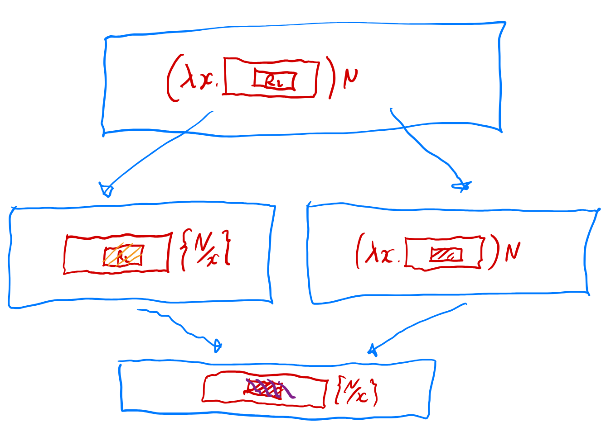
     - nel ramo di sinistra un redesso altera l'altro ($R_2$ modificato, ma non ridotto)
     - nel ramo di destra $R_2$ viene ridotto, ma senza aver effettuato la sostituzione
     - serve dimostrare un teorema per certificare che anche in questa casistica si converge (non ovvio)

     Esempio:

     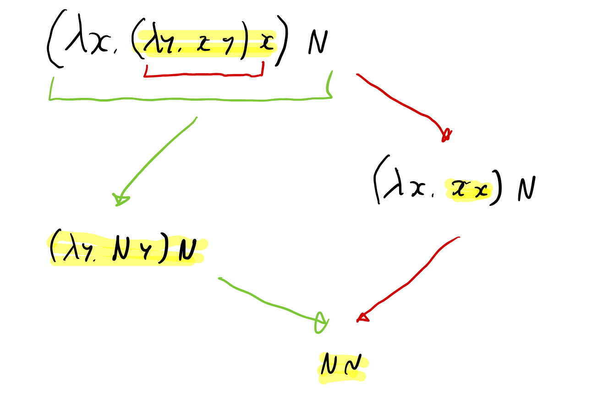

     Dalla colorazione nell'esempio emerge l'idea della dimostrazione $\to$ **tenere traccia** dei residui ottenuti
     dal redesso iniziale nell'arco della dimostrazione

#### Teorema per dimostrare ultimo caso confluenza $\lambda$-calcolo (confluenza locale)

$$
((\lambda x.M)N)\{u/y\} \to_{\beta}M\{N/x\}\{u/y\}
$$

**Dimostrazione**

Ci sono due casistiche possibili:

- $x = y$:

  Dal momento che $((\lambda x.M)N)\{u/y\} = (\lambda x.M)\{u/y\}N\{u/y\}$:

  $$
    (\lambda x.M )\{u/x\}N\{u/x\} = (\lambda x.M)N\{u/x\} \to_{\beta}
    M \{\frac{N\{u/x\}}{x}\} = M\{N/x\}\{u/x\}
  $$

  L'ultima uguaglianza richiede un lemma per essere dimostrata. Nell'espressione $M\{\frac{N\{u/x\}}{x}\}$
  , le due $x$ non sono la stessa cosa $\to$ quella sopra è **globale** e libera solo in $N$, mentre
  quella sotto compare libera in $M$.

- $x \ne y$:

  > **Attenzione !!!**: questo caso è stato omesso dal prof, dimostrazione mia.

$$
\begin{aligned}
& (\lambda x.M)N \{u/y\}\\
& = ((\lambda x.M)N) \{u/y\}\\
& = (\lambda x.M)\{u/y\} N \{u/y\}\\
& = (\lambda x.M\{u/y\}) N \{u/y\}\\
\end{aligned}
$$

L'ultima uguaglianza è possibile sotto l'ipotesi $x \ne y$ e $x \not \in \text{FV}(u)$.

$$
\begin{aligned}
& (\lambda x.M\{u/y\}) N \{u/y\} \\
& \to_{\beta} (M\{u/y\}) \{\frac{N \{u/y\}}{x}\} \\
& = M \{N/x\} \{u/y\} \\
\end{aligned}
$$

Anche quest'ultima uguaglianza è possibile sotto l'ipotesi $x \ne y$.

#### Lemma ($M\{N/x\}\{u/x\} = M\{\frac{N\{u/x\}}{x}\}$)

> **Attenzione !!!**
>
> La dimostrazione come viene proposta è tecnicamente **non valida**, in quanto prima delle sostituzioni
> che interessano $M$, andrebbe introdotto un ulteriore cambio di nome di variabile.
> Il problema sopra nominato emerge nei casi induttivi.

Si vuole dimostrare:

$$
  M\{N/x\}\{u/x\} = M\{\frac{N\{u/x\}}{x}\}
$$

**Dimostrazione**

La dimostrazione procede per induzione sulla struttura di $M$:

- caso $x$

$$
  x\{N/x\}\{u/x\} = N\{u/x\} = x\{\frac{N\{u/x\}}{x}\}
$$

- caso $y$:

$$
  y\{N/x\}\{u/x\} = y\{u/x\} = y = y\{\frac{N\{u/x\}}{x}\}
$$

- caso $\lambda z.L$:

  Per la dimostrazione di questo caso si rende necessario l'impiego della seguente ipotesi induttiva:

$$
  L\{N/x\}\{u/x\} = L\{\frac{N\{u/x\}}{x}\}
$$

$$
\begin{aligned}
& (\lambda z.L)\{N/x\}\{u/x\} = \\
& ((\lambda w.L)\{w/z\}\{N/x\})\{u/x\} = \quad \text{ con } w \not \in \text{FV}(L) \cup \text{FV}(N) \cup \text{FV}(u) \\
& \lambda w.L\{w/z\}\{N/x\}\{u/x\} = \\
\end{aligned}
$$

A questo punto posso applicare l'ipotesi induttiva su $L \{N/x\}\{u/x\}$. In questo punto si verifica
la non validità della dimostrazione $\to$ dovrei modificare l'enunciato per includere $\{w/z\}$.

> Nota ulteriore: la variabile $w$ viene introdotta per evitare che $z$ effettui catture accidentali delle
> variabili libere presenti in $N$.

$$
\begin{aligned}
& \lambda w.L \{w/z\}\{\frac{N\{u/x\}}{x}\} = \\
& \lambda z.L \{\frac{N\{u/x\}}{x}\}\\
\end{aligned}
$$

Quest'ultima uguaglianza è possibile grazie al fatto che $w$ è **sufficientemente fresca**.

- caso $\lambda x.L$:

  > **Attenzione !!!**: questo caso è stato omesso dal prof, dimostrazione mia.

$$
\begin{aligned}
& (\lambda x.L)\{N/x\}\{u/x\} =     \\
& \lambda x.L =                     \\
& \lambda x.L \{\frac{\{u/x\}}{x}\} \\
\end{aligned}
$$

Questo caso è molto semplice, infatti la $x$ non è libera, e quindi **non sostituibile**.

- caso $M P$:

  > **Attenzione !!!**: questo caso è stato omesso dal prof, dimostrazione mia.

  Per la dimostrazione di questo caso si rende necessario l'impiego delle seguenti ipotesi induttive:

$$
  M\{N/x\}\{u/x\} = M\{\frac{N\{u/x\}}{x}\}
$$

$$
  P\{N/x\}\{u/x\} = P\{\frac{N\{u/x\}}{x}\}
$$

La dimostrazione di questo consiste nell'applicazione delle due ipotesi induttive sfruttando la
definizione della sostituzione sull'applicazione.

$$
\begin{aligned}
& (M P)\{N/x\}\{u/x\} = \\
& (M\{N/x\}\{u/x\})(P\{N/x\}\{u/x\}) = \\
& (M\{\frac{N\{u/x\}}{x}\}) (P\{\frac{N\{u/x\}}{x}\}) \\
& (M P \{\frac{N\{u/x\}}{x}\}) \\
\end{aligned}
$$

A questo punto è stata dimostrata la **confluenza locale** del $\lambda$-calcolo $\to$ serve dimostrare
la **semi-confluenza (confluenza)**.

### Dimostrazione semi-confluenza $\lambda$-calcolo

L'idea alla base di questa dimostrazione si base sull'utilizzio di un **artificio sintattico** per tenere traccia
dei residui del redesso contenuto del termine iniziale. Per fare ciò viene introdotto il **$\lambda$-calcolo sottolineato**:

$$
\underline{t} ::=  x \mid \underline{t} \underline{t} \mid \lambda x. \underline{t} \mid \underline{\lambda} x. \underline{t}
$$

L'unica differenza è data dall'introduzione della $\lambda$-astrazione **marcata**.

#### Definizione $\beta$-riduzione marcata

Le regole d'inferenza della $\beta$-riduzione rimangono:

$$
\dfrac{}{(\lambda x.\underline{M})\underline{N} \to_{\beta} \underline{M}\{\underline{N}/x\}}
$$

$$
\dfrac{\underline{M} \to_{\beta} \underline{M'}}{\underline{M} \underline{N} \to_{\beta} \underline{M'}\underline{N}}
$$

$$
\dfrac{\underline{M} \to_{\beta} \underline{M'}}{\underline{N} \underline{M} \to_{\beta} \underline{N}\underline{M'}}
$$

$$
\dfrac{\underline{M} \to_{\beta} \underline{M'}}{\lambda x.\underline{M} \to_{\beta} \lambda x.\underline{M'}}
$$

Vengono aggiunte le seguenti regole:

$$
\dfrac{}{(\underline{\lambda} x.\underline{M})\underline{N} \to_{\beta} \underline{M}\{\underline{N}/x\}}
$$

$$
\dfrac{\underline{M} \to_{\beta} \underline{M'}}{\underline{\lambda} x.\underline{M} \to_{\beta} \underline{\lambda} x.\underline{M'}}
$$

**Osservazioni**

1. Dalla prima nuova regola si intuisce che la marcatura **non altera** la computazione.
2. Dalla seconda nuova regola si intuisce che la marcatura ci permette di tenere traccia dell'evoluzione del
   redesso d'interesse.

#### Definizione sostituzione marcata

$\underline{M}\{\underline{N}/x\}$ è definito come:

- $x\{\underline{M}/x\} = \underline{M}$
- $y\{\underline{M}/x\} = y$
- $(\underline{t_1 t_2})\{\underline{N}/x\} = \underline{t_1} \{\underline{N}/x\}\underline{t_2} \{\underline{N}/x\}$
- $(\lambda x.\underline{M})\{\underline{N}/x\} = \lambda x.\underline{M}$ $\to$ tutte le $x$ in $M$ sono legate, quindi non libere e non sostituibili.
- $(\lambda y.\underline{M})\{\underline{N}/x\} = \lambda z.\underline{M}\{z/y\}\{\underline{N}/x\}$ per $z \not\in \text{FV}(M) \cup  \text{FV}(N)$
- $(\underline{\lambda} y.\underline{M})\{\underline{N}/x\} = \underline{\lambda} z.\underline{M}\{z/y\}\{\underline{N}/x\}$ per $z \not\in \text{FV}(M) \cup  \text{FV}(N)$

#### Funzioni di rimozione della marcatura

1. **Funzione di smarcatura**: $\mid \cdot \mid: \underline{\Lambda} \to \Lambda$. Definizione:
   - $\mid x \mid = x$
   - $\mid \underline{MN} \mid = \mid \underline{M}\mid \mid \underline{N} \mid$
   - $\mid \lambda x. \underline{M} \mid = \lambda x. \mid \underline{M} \mid$
   - $\mid \underline{\lambda} x. \underline{M} \mid = \lambda x. \mid \underline{M} \mid$ $\to$ qui avviene la smarcatura

2. **Funzione di smarcatura e riduzione** $\to$ realizza una $\beta$-riduzione in parallelo di tutti **e soli** i
   redessi marcati. Eg. $((\underline{\lambda} x. \underline{M}) \underline{N})$. $\phi: \underline{\Lambda} \to \Lambda$. Definizione:
   - $\phi (x) = x$
   - $\phi (\underline{MN}) = \phi(\underline{M}) \phi(\underline{N}) \quad \text{se il primo termine non è un'
    astrazione marcata}$
   - $\phi (\lambda x. \underline{M}) = \lambda x. \phi (\underline{M})$
   - $\phi ((\underline{\lambda} x. \underline{M}) \underline{N}) = \phi (\underline{M}) \{ \frac{\phi (\underline{N})}{x}\}$

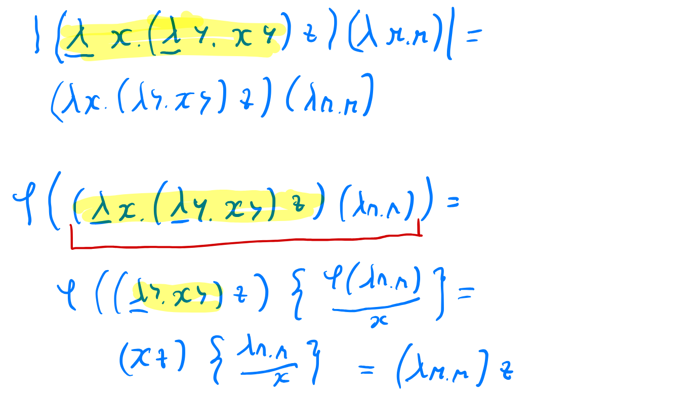

#### Lemma 1

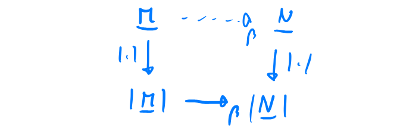

Questo lemma conferma che la marcatura **non** influisce sulla computazione $\to$ smarcare e poi ridurre equivale
a ridurre e poi smarcare.

**Dimostrazione**

Per dimostrare si procede per induzione sulla struttura dell'albero di prova $\mid \underline{M} \mid 
\to_{\beta} \mid \underline{N} \mid$:

- **Caso $\dfrac{}{(\lambda x.N_1)N_2 \to_{\beta} N_1\{N_2/x\}}$**

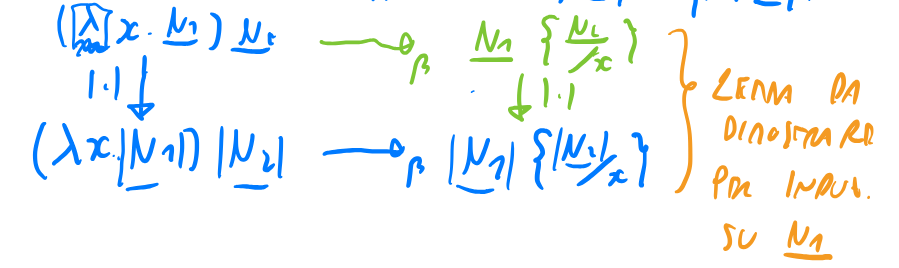

> **Nota 1:** il lemma che viene mostrato nell'immagine **non** viene dimostrato.
>
> **Nota 2:** il quadratino intorno a $\lambda$ indica che può trattarsi sia di $\lambda$ che di $\underline{\lambda}$.

- **Caso $\dfrac{M_1 \to_{\beta} M_1'}{M_1 M_2 \to_{\beta} M_1' M_2}$**

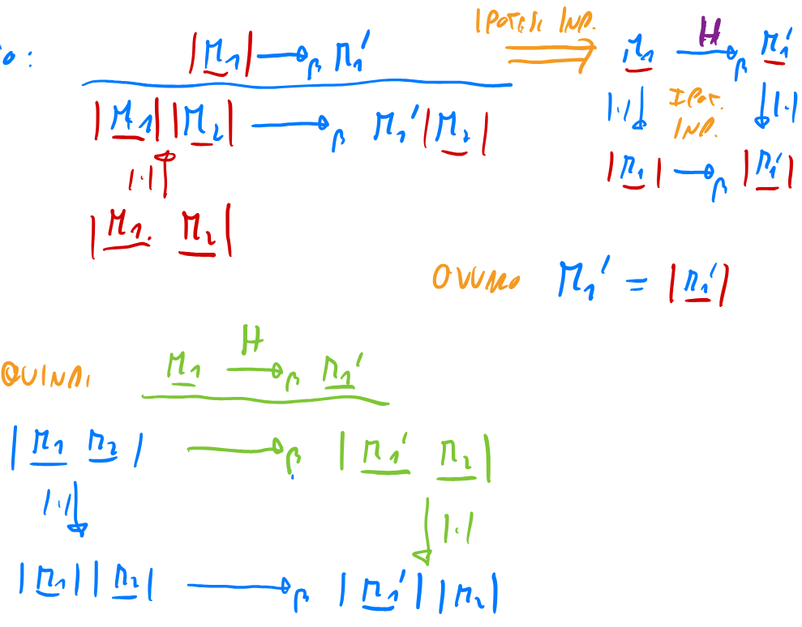

La freccia verde orizzontale è possibile in quanto H è la premessa della regola di $\beta$-riduzione $\to$
ottenuta applicando l'ipotesi induttiva.
L'ipotesi induttiva è ciò che mi permette di stabilire che $M_1'$ nella premessa dell'albero è
$\mid \underline{M_1'} \mid$

- **Caso $\dfrac{ M_2  \to_{\beta} M_2'}{ M_1 M_2 \to_{\beta} M_1 M_2'}$** $\to$ analogo al precedente

- **Caso $\dfrac{ M_2  \to_{\beta} M_1'}{ \lambda x. M_1 \to_{\beta} \lambda x. M_1'}$** $\to$ come sopra

I casi sono le 4 possibili regole del $\lambda$-calcolo classico (non sottolineato) perché
stiamo trattando un passo di $\beta$-riduzione fra termini smarcati. $\to$ impossibile ci sia
un'strazione marcata.

Il ragionamento parte da questo passo di riduzione e mi chiedo dal primo termine: "quale termine posso smarcare
per arrivare a quest'altro termine smarcato?".

#### Lemma 2

Simile al lemma 1. Anche qui la dimostrazione avviene per induzione sull'albero di prova per $\underline{M}
\to_{\beta} \underline{N}$. Va sottolineato che la dimostrazione sarebbe una doppia induzione, in cui si
aggiunge un'induzione sul numero di passi $n$ di $\beta$-riduzione.

**Enunciato**

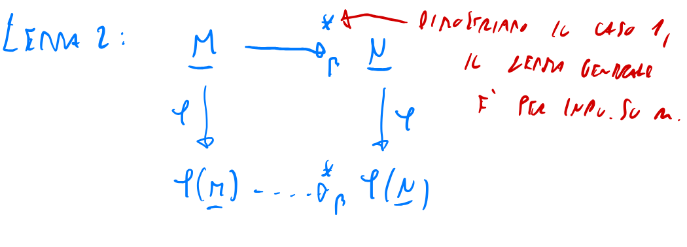

**Dimostrazione (solo caso $n = 1$)**

- **Caso $\dfrac{\underline{M_1} \to_{\beta} \underline{M_1}'}{\lambda x. \underline{M_1} \to_{\beta} \lambda x.\underline{M_1}'}$**

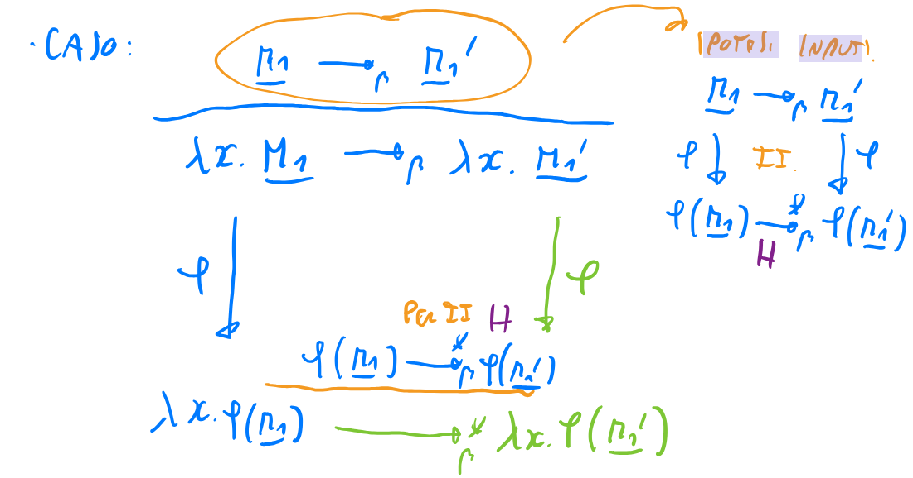

- altri casi per pura ricorsione sono analoghi (sperem)

- **Caso $\dfrac{}{(\lambda x. \underline{M_1}) \underline{N_1} \to_{\beta} \underline{M_1}
\{ \underline{N_1} / x\}}$**

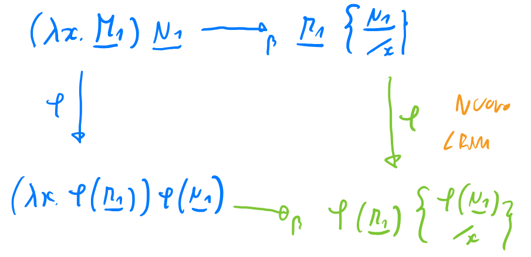

- **Caso $\dfrac{}{(\underline{\lambda} x. \underline{M_1}) \underline{N_1} \to_{\beta} \underline{M_1}
\{ \underline{N_1} / x\}}$**

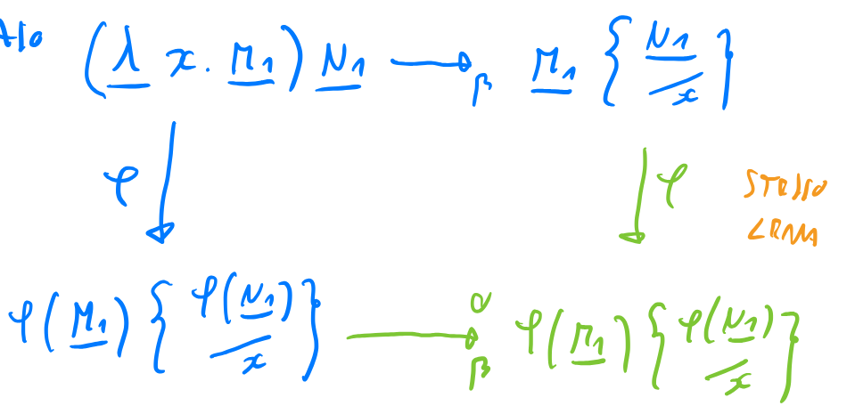

Questi due ultimi casi richiedono l'utilizzo di un lemma che va dimostrato. Una volta dimostrato questo lemma
aggiuntivo, la dimostrazione del lemma 2 può considerarsi conclusa (caso n = 1).

> **NOTA !!**: questo lemma aggiuntivo **non varrebbe** se si potesse creare un nuovo redesso con la sostituzione
> $\to$ impossibile $\to$ il lemma vale. L'unica possibilità sarebbe la seguente:
> $x M \{\frac{\underline{\lambda} x. N}{x}\} = (\underline{\lambda} x.N)M$ $\to$ posso ritrovarmi in questa
> casistica solo partendo da $(\lambda x. x M)(\underline{\lambda} x.N)$ $\to$ astrazione marcata che non è la
> testa di un redex $\to$ **impossibile** per come avviene la marcatura e perché nel termine iniziale
> viene **marcata la testa di un redex**.

##### Lemma usato in lemma 2

**Enunciato**

$$
\phi (\underline{M}\{\underline{N}/x\}) = \phi(\underline{M})\{\phi(\underline{N})/x\}
$$

**Dimostrazione**
La prova avviene per induzione sulla struttura ricorsiva di $\underline{M}$:

- **caso $x$**
  $$
  \phi(x \{\underline{N}/x\}) = \phi (\underline{N}) = x \{\phi(\underline{N})/x\} = \phi(x) \{\phi(\underline{N})/x\}
  $$
- **caso $y$**

  $$
  \phi(y \{\underline{N}/x\}) = \phi(y) = y = y \{\phi(\underline{N})/x\} = \phi(y) \{\phi(\underline{N})/x\}
  $$

- **caso $\lambda z. \underline{M'}$**

  Ipotesi induttiva:

  $$
  \phi(\underline{M'}\{\underline{N}/x\}) = \phi(\underline{M'})\{\phi(\underline{N})/x\}
  $$

  Dimostrazione:

  Assunzione per semplificare: $z \not \in \text{FV}(\underline{N})$

  $$
  \begin{aligned} \\
  & \phi((\lambda z.\underline{M'})\{\underline{N}/x\}) = \phi(\lambda z. (\underline{M'}\{\underline{N}/x\})) = \lambda z. \phi(\underline{M'}\{\underline{N}/x\}) \stackrel{\text{II}}{=} \\
  & \lambda z.(\phi(\underline{M'})\{\phi(\underline{N})/x\}) = (\lambda z. \phi(\underline{M'}))\{\phi(\underline{N})/x\} = \\
  & \phi(\lambda z. \underline{M'})\{\phi(\underline{N})/x\} = \\
  \end{aligned}
  $$

- **caso $\underline{M_1 M_2}$** $\to$ analogo (se $M1$ non è un'astrazione marcata)

- **caso $(\underline{\lambda} z. \underline{M_1}) \underline{M_2}$**

  Ho delle ipotesi induttive valide sia su $M_1$ che $M_2$.

  $$
  \begin{aligned}
  & \phi(((\underline{\lambda} z. \underline{M_1}) \underline{M_2})\{\underline{N}/x\}) = \\
  & \phi((\underline{\lambda} z. \underline{M_1} \{\underline{N}/x\})(\underline{M_2} \{\underline{N}/x\})) = \\
  & \phi(\underline{M_1} \{\underline{N}/x\}) \{\frac{\phi(\underline{M_2} \{\underline{N}/x\})}{z}\} =\\
  & \phi(\underline{M_1}) \{\phi(\underline{N})/x\} \{\frac{\phi(\underline{M_2}) \{\phi(\underline{N})/x\}}{z}\} =\\
  & \phi(\underline{M_1}) \{\phi(\underline{M_2})/z\}) \{\phi(\underline{N})/x\} =\\
  \end{aligned}
  $$

  Quest'ultima uguaglianza è possibile grazie a **un altro lemma** $\to$
  $M\{N/x\}\{L/y\} = M\{L/y\}\{\frac{N\{L/y\}}{x}\}$. Questo lemma vale solo se
  $x \not \in \text{FV}(L)$, che in questo caso è vero in quanto $z \not \in \text{FV}(\phi(N))$, dal
  momento che $z$ è **fresca**.

  $$
  \begin{aligned}
  & \phi(\underline{M_1}) \{\phi(\underline{M_2})/z\}\{\phi(\underline{N})/x\} = \\
  & \phi((\underline{\lambda} z.\underline{M_1}) \underline{M_2}) ) \{\phi(\underline{N})/x\} \\
  \end{aligned}
  $$

#### Lemma 3

**Enunciato**

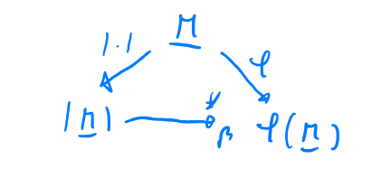

**Dimostrazione**

Per induzione su $M$:

- **caso $x$**

  $$
  \mid x \mid = x \to_{\beta}^0 x = \phi(x)
  $$

- **caso $\lambda x. \underline{N}$**

  Per ipotesi induttiva:

  $$
  \mid \underline{N} \mid \to_{\beta}^* \phi(\underline{N})
  $$

  $$
  \mid \lambda x. \underline{N} \mid = \lambda x. \mid \underline{N} \mid \longrightarrow_{\beta}^*
  \lambda x. \phi(\underline{N}) = \phi(\lambda x. \underline{N})
  $$

  Ciò che accade è l'applicazione più volte (più passi) della regola $\dfrac{M \to_{\beta} M'}{\lambda x.M \to_{\beta} \lambda x.M'}$:

  $$
  \dfrac{M_1 \to_{\beta} M_2 \to_{\beta} \dots \to_{\beta} M_n}{\lambda x.M_1 \to_{\beta} \lambda x.M_2 \to_{\beta} \dots \to_{\beta} \lambda x.M_n}
  $$

- **caso $N_1 N_2$** (con $N_1$ che non sia astrazione marcata)

  Ipotesi induttive:

  $$
  \mid \underline{N_i} \mid \to_{\beta}^* \phi(\underline{N_i}) \quad \quad \forall i \in \{1,2\}
  $$

  Essendo che $\mid \underline{N_1 N_2} \mid = \mid \underline{N_1} \mid \mid \underline{N_2} \mid$ e
  $\phi(\underline{N_1 N_2}) = \phi(\underline{N_1}) \phi(\underline{N_2})$, applicando
  le ipotesi induttive si ottiene:

  $$
  \mid \underline{N_1} \underline{N_2} \mid = \mid \underline{N_1} \mid \mid \underline{N_2} \mid
  \longrightarrow_{\beta}^* \phi(\underline{N_1}) \phi(\underline{N_2}) = \phi(\underline{N_1 N_2})
  $$

- **caso $(\underline{\lambda} x. \underline{N_1}) \underline{N_2}$**:

  Ipotesi induttive:

  $$
  \mid \underline{N_i} \mid \to_{\beta}^* \phi(\underline{N_i}) \quad \quad \forall i \in \{1,2\}
  $$

  $$
  \begin{aligned}
  & \mid (\underline{\lambda} x. \underline{N_1}) \underline{N_2} \mid  \\
  & = (\lambda x. \mid \underline{N_1} \mid) \mid \underline{N_2} \mid  \\
  & \to_{\beta}^* (\lambda x. \phi(\underline{N_1})) \phi(\underline{N_2}) \\
  & \to_{\beta} \phi(\underline{N_1}) \{\phi(\underline{N_2})/x\} \\
  & = \phi((\underline{\lambda} x. \underline{N_1})\underline{N_2}) \\
  \end{aligned}
  $$

  > **Nota**: L'ultima uguaglianza vale per definizione di $\phi$.

### Teorema di semi-confluenza per il $\lambda$-calcolo

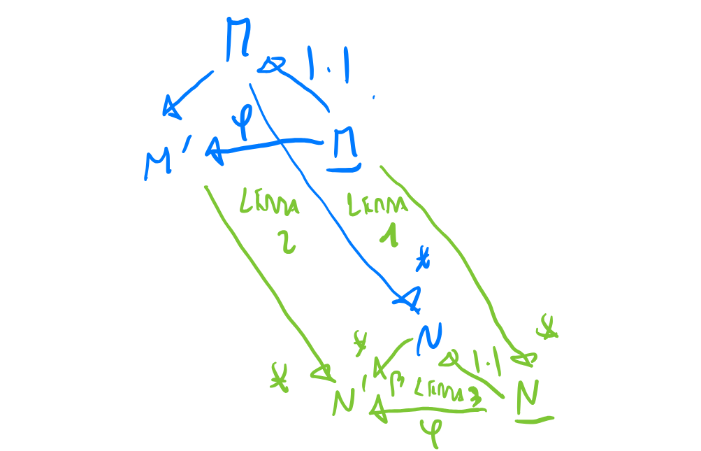

> **Idea per ricordare**:
>
> - lemma 1 $\to$ permette di chiudere il _parallelogramma_ con $\mid \cdot \mid$
> - lemma 2 $\to$ permette di chiudere il _parallelogramma_ con $\phi$
> - lemma 3 $\to$ permette di chiudere il _triangolo_ con $\phi$ e $\mid \cdot \mid$

$\underline{M}$ ha come **unico** redex marcato quello che voglio ridurre in un
solo passo nell'enunciato.

## Dalle proprietà dei programmi ai sistemi di tipo

Viene fissato un formalismo di calcolo Turing completo (non importa quale):

- $Prog$ è l'insieme dei programmi codificabili nel formalismo
- Una proprietà di programmi $P$ è un sottoinsieme di $Prog$. Le proprietà possono
  riguardare sia il comportamento (**dinamica**) che la **scrittura** del
  programma.
- un proprietà di programmi $P$ è banale sse $P = \empty \lor P = Prog$
- $p \approx q$ ($p$ e $q$ hanno la **stessa estensione**) sse $\forall i. 
(p(i) \Uparrow \iff q(i) \Uparrow) \land (p(i) \Downarrow \iff q(i) \Downarrow)$.
  Significa che i due programmi calcolano le stesse cose.
- Una proprietà $P$ è **estensionale** sse $\forall p,q \text{ tc } p \approx q \implies 
(p \in P \iff q \in P)$
- Una proprietà è **intensionale** sse non è estensionale
- Una proprietà $P$ è **decidibile** sse $\exists  p \in Prog \text{ tc } \forall q \in 
Prog.((q \in P \iff p(q) \Downarrow \text{ True }) \land (q \not \in P \iff p(q) \Downarrow 
\text{ False}))$

### Teorema di Rice

> Ogni proprietà **decidibile ed estensionale** è **banale**.

Le proprietà estensionali e non decidibili sono (purtroppo) quelle più interessanti,
, ma non possono essere studiate $\to$ si studia un'approssimazione $P'$ di $P$ che
sia decidibile.

### Approssimazioni

Esistono 3 tipi di approssimazioni:

- **Da dentro** $\to$ $Q$ approssima $P$ da dentro sse $Q \subset P$.
  Si indica con $P^<$
- **Da fuori** $\to$ $Q$ approssima $P$ da dentro sse $Q \supset P$.
  Si indica con $P^>$
- **Miste** $\to$ non sono ne di un tipo ne dell'altro

> **Osservazione**: le approssimazioni miste sono inutili
>
> - se $p \in P^<$ allora so che $p \in P$, non so nulla se $p \not \in P^<$
> - se $p \not \in P^>$ allora so che $p \not \in P$, non so nulla se $p \in P^>$
> - con il terzo tipo non ottengo nessuna informazione utile

Si vuole utilizzare **tecniche di approssimazione** per creare approssimazioni
**decidibili** di proprietà **non decidibili**.

### Interpretazione Astratta

Si tratta di un esempio di tecnica di approssimazione dell'esecuzione del codice.
Approssima un programma utilizzando un numero **finito** di stati.

Ogni tipo di dato viene associato a un'informazione parziale $\to$ dal momento che
gli stati sono finiti $\to$ i tipi vengono approssimati con dei tipi con **domini
finiti**.

Un esempio di una possibile approssimazione dei gli interi $\mathbb{Z}$ potrebbe
essere la seguente:

$$
\overline{\mathbb{Z}} = \{pos, zero, neg\}
$$

In seguito devo definire la versione approssimata delle operazioni.
Esempio con \+: $pos + pos = pos$, $neg + neg = neg$ $pos + zero = pos$, $pos + neg = \bot$.

L'ultimo esempio corrisponde a un caso in cui al risposta dell'approssimazione non
fornisce alcuna informazione utile.

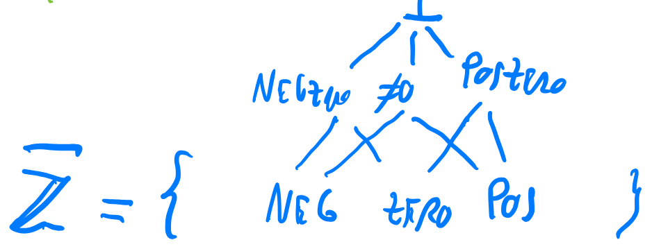

L'immagine riporta il **reticolo** ottenibile dal dominio del tipo approssimato
$\to$ si tratta di una struttura algebrica in cui andando verso l'alto decresce il
contenuto informativo del valore.

In segutio si estende l'astrazione anche ai **costrutti** del linguaggio.
Esempio:

```python
if x > 0:
    return 1
else:
    return 0
```

diventa

```python
if x > zero then
    return pos
else
    return zero
```

$x = pos \mapsto pos$

$x = negpos \mapsto poszero$

Il secondo caso ritorna $poszero$ perché è l'insieme dei due rami dato che non è
possibile decidere.

#### Pro e Contro

**Pro**:

- approssimazioni ottime
- molto utile per trovare bug in codice molto grandi e complessi

**Contro**:

- richiede un processo manuale complesso
- non è modulare $\to$ richiede l'analisi di tutto il codice
- costo computazionale elevato $\to$ esecuzione iterativa del codice per un numero
  elevato di stati

L'alternativa è rappresentata dai **sistemi di tipo**.

### Sistemi di tipo

Sono approssimazioni decidibili di una qualche proprietà, con l'utile caratteristica di essere modulari.
Possono essere sia da dentro che da fuori. Può anche variare il loro livello di precisione,
infatti. Aumento precisione $\to$ diminuzione livello di _aiuto_ (annotazioni ulteriori) del programmatore.

Si vuole verificare se una determinata unità gode della proprietà per cui il sistema di tipo
è stato realizzato, come determino questa cosa sapendo che le sotto unità
godono della proprietà.

> **Tipi**: sono òa più piccola informazione che l'unità ha la proprietà.

Il passaggio dalle sotto-unità alle unità viene detto **controllo** di tipo.
Quando si vuole realizzazione un sistema di tipi si procede nel seguente modo:

1. Scelta proprietà indecidibile da approssimare
2. Design e realizzazione del sistema di tipi
3. Dimostrazione di un teorema che verifichi la corretteza del sistema di tipi

#### Sistema di tipi semplici

Presentazione alla Curry, in cui i termini sono privi di informazioni di tipo.

$$
t := x \mid \lambda x.t \mid tt
$$

Grammatica per i tipi:

$$
T ::= \alpha \mid T \to T
$$

- $\alpha$ è un'annotazione generica per un tipo
- $\to$ associa a destra: $A \to B \to C$ diventa $A \to (B \to C)$

Occorre realizzare la mappatura tra variabili e tipi, ciò avviene tramite un **contesto**
che ha la seguente grammatica:

$$
\Gamma ::= \epsilon \mid \Gamma , x:T
$$

Si suppone che non esistano due entry $(x: T_1), (x: T_2)$ nel contesto.
Infine viene definito il **giudizio di tipaggio** tramite un sistema d'inferenza
che modella la relazione ternaria: $\Gamma \vdash t: T$

$$
\frac{(x : T) \in \Gamma}
     {\Gamma \vdash x : T}
\qquad
\frac{\Gamma \vdash M : T_1 \to T_2 \quad \Gamma \vdash N : T_1}
     {\Gamma \vdash M\,N : T_2}
\qquad
\frac{\Gamma, x : T_1 \vdash M : T_2}
     {\Gamma \vdash \lambda x. M : T_1 \to T_2}
$$

Si osserva che la terza regola **non è** un algoritmo $\to$ viene introdotto
$T_1$ non sapendo cosa esso sia effettivamente.

Esempio di tipaggio per $\lambda f. \lambda x. fx$

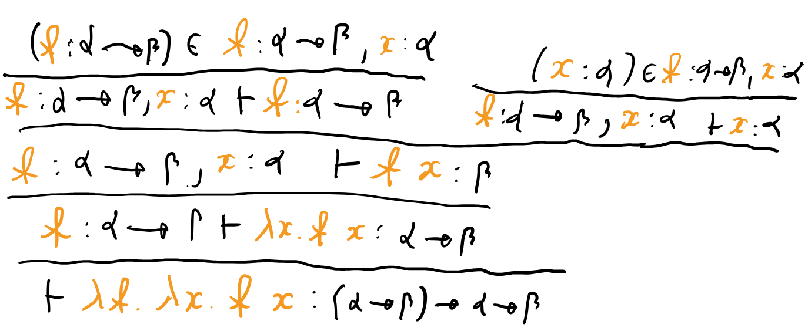

L'obbiettivo è andare a compilare i tipi. $\to$ si parte con degli spazi vuoti,
quando si arriva in alto, verranno compilati i primi tipi, che verranno poi
riscritti fino ad arrivare alla fine.

Non tutte le espressioni in $\lambda$-calcolo possono essere tipate $\to$ esemio $\lambda x.xx$

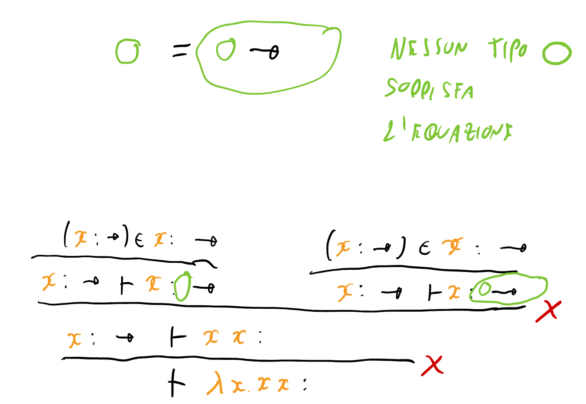

##### Church vs Curry

- Church propone l'approccio basato su **type checking** $\to$ programmatore annota
  esplicitamente i tipi e type system esegue controlli sulle annotazioni.
- Curry propone l'approccio basato su **type inference** $\to$ il compilatore
  annota i tipi da solo.

Il secono approccio ha due contro:

- tipi non annotati $\to$ codice meno documentato (risolvibile con un buon IDE)
- in alcuni casi capità che la spiegazione dell'errore di tipaggio sia errata.

### Logica proposizionale minimale

$$
F ::= \alpha \mid F \to F
$$

- $\to$ implicazione logica associativa a destra.

Ipotesi (contesto):

$$
\Gamma ::= \epsilon \mid \Gamma, F
$$

$\Gamma \vdash F$ relazione binaria descritta tramite sistema d'inferenza:

$$
\frac{F \in \Gamma}
     {\Gamma \vdash x : T}
\qquad
\frac{\Gamma \vdash F_1 \to F_2 \quad \Gamma \vdash F_1}
     {\Gamma \vdash F_2}
\qquad
\frac{\Gamma, F_1 \vdash F_2}
     {\Gamma \vdash F_1 \to F_2}
$$

La seconda è l'**eliminazione** dell'implicazione. La terza è l'**introduzione** dell'implicazione.

## Isomorfismo di Curry-Howard-Kolmogorov

$$
\frac{(x : T) \in \Gamma}
     {\Gamma \vdash x : T}
\qquad
\frac{\Gamma \vdash M : T_1 \to T_2 \quad \Gamma \vdash N : T_1}
     {\Gamma \vdash M\,N : T_2}
\qquad
\frac{\Gamma, x : T_1 \vdash M : T_2}
     {\Gamma \vdash \lambda x. M : T_1 \to T_2}
$$

$$
\frac{F \in \Gamma}
     {\Gamma \vdash x : T}
\qquad
\frac{\Gamma \vdash F_1 \to F_2 \quad \Gamma \vdash F_1}
     {\Gamma \vdash F_2}
\qquad
\frac{\Gamma, F_1 \vdash F_2}
     {\Gamma \vdash F_1 \to F_2}
$$

Si nota che i due sistemi d'inferenza sono pressoché **identici**.

| $\lambda$-calcolo                                       | Logica                                   |
| ------------------------------------------------------- | ---------------------------------------- |
| Tipi                                                    | Formule                                  |
| Termini                                                 | Prova (albero)                           |
| variabili di tipo                                       | Variabili proposizionali                 |
| Costruttori di tipo ($\times$, unioni disgiunte, AlgDT) | Connettivi logici                        |
| Costrutti del linguaggio                                | Regole di introduzione e di eliminazione |
| Variabili libere                                        | Ipotesi globali                          |
| Variabili legate                                        | Ipotesi locali                           |
| Type checking ($\Gamma , t, T$ sono gli input)          | Proof checking                           |
| Type inhabitation ($\Gamma , T$ sono input, $t$ output) | Ricerca della prova                      |
| Normalizzazione                                         | Normalizzazione / Cut elimination        |
| Redex                                                   | Introduzione + Eliminazione              |
| Tipi di dato algebrici                                  | Forme normali disgiunte                  |

Aumentando la complessità della logica in esame, aggiungo nuovi costrutti al mio linguaggio, ed
ho la garanzia che essi siano dei buoni costrutti **grazie all'isomorfismo**.

I $\lambda$-termini equivalgono alla prova, in quanto osservando bene si nota che
sono essi stessi che determinano la struttura dell'albero di derivazione.

### Subject reduction (TH)

Proprietà buona che un buon sistemi di tipi dovrebbe avere. $\to$ la riduzione preserva il tipaggio.

$$
\forall \Gamma, t_1, t_2, T. \Gamma \vdash t_1: T \land t_1 \to^* t_2 \implies \Gamma \vdash t_2:T
$$

Per l'isomorfismo, lato logica, questa proprietà sembra tradursi nella possibilità di riscrivere
la dimostrazione in modo diverso.

#### Congiunzione

$$
F ::= \dots \mid F \land F
$$

$$
T ::= \dots \mid T \times T
$$

$$
t ::= \dots \mid \langle t,t\rangle \mid t.1
$$

$$
\langle t_1 , t_2 \rangle .1 \to t_1
$$

$$
\langle t_1 , t_2 \rangle .2 \to t_2
$$

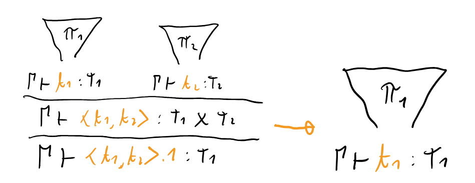

#### Congiunzione (eliminazione alternativa)

$$
F ::= \dots \mid F \land F
$$

$$
T ::= \dots \mid T \times T
$$

$$
t ::= \dots \mid \langle t,t\rangle \mid (x, y) = x; M
$$

$$
\langle t_1, t_2 \rangle ; M \to M\{t_1 / x, t_2 / y\}
$$

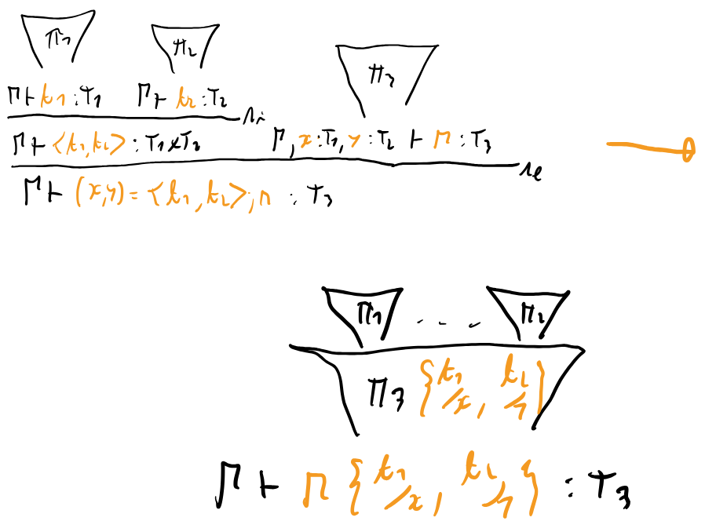

La seconda dimostrazione è ottenuta in modo analogo a come viene ottenuta la seconda dimostrazione
dell'implicazione.

##### Definizione come tipo algebrico

$$
\text{type } A \times B =  \langle, \rangle : A \to B \to A \times B
$$

#### Implicazione

$$
(\lambda x.M)N \to_{\beta} M\{N/x\}
$$

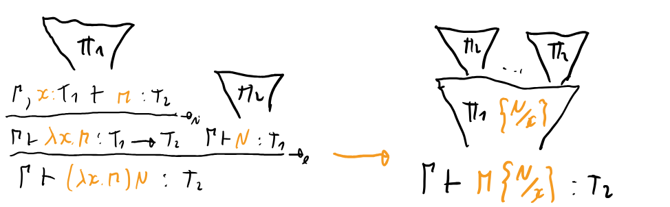

Riguardo $\pi_1\{N/x\}$ non ho assunzioni, in quanto non so nulla su $N$.
Le $x$ che erano in M nella prima dimostrazione, sicuramente comparivano nelle foglie per come è
stato definito il sistema di inferenza $\to$ ora in quelle foglie devo dimostrare $N$ invece di $x$.
Ciò avviene _incollando_ le dimostrazioni di $N$ della prima dimostrazione, come mostrato nella figura.

#### Disgiunzione

$$
F ::= \dots \mid F \lor F
$$

$$
T ::= \dots \mid T + T
$$

$$
\begin{aligned}
& t ::= \dots \mid \iota_1 t \mid \iota_2 t \mid \\
& \text{match } t \text{ with} \mid \iota_1 x \implies M \mid \iota_2 y \implies N
\end{aligned}
$$

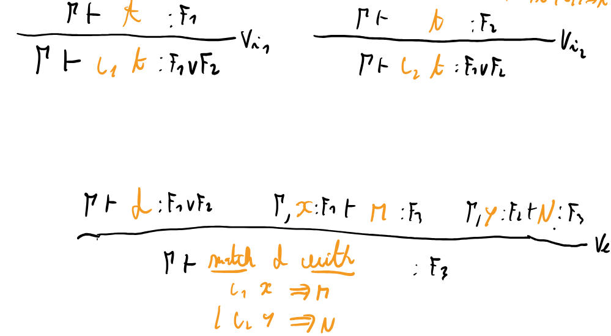

##### Definizione come tipo algebrico

$$
\begin{aligned}
& \text{type } A + B = \\
& \mid \iota_1 : A \to A + B\\
& \mid \iota_2 : B \to A + B\\
\end{aligned}
$$

### Teorema (forme normali disgiunte)

> Ogni formula $F$ della logica proposizionale classica è **logicamente equivalente** a una
> **disgiunzione di congiunzioni** > $$F \equiv \lor_i \land_j G_{ij} \quad \text{ dove } G_{ij} = A \text{ o } G_{ij} = \lnot A \text{ con } A \text{ variabile proposizionale }$$
>
> Le formule $G_{ij}$ prendono il nome di **forme normali disgiunte**

Esempio

$$
\begin{aligned}
& (\lnot A \implies B) \land (C \lor \lnot D) \\
& \equiv (\lnot \lnot A \lor B) \land (C \lor \lnot D) \\
& \stackrel{distr.}{\equiv} (\lnot \lnot A \land C) \lor (\lnot \lnot A \land \lnot D) \lor (B \land C) \lor (B \land \lnot D) \\
& \equiv A \land C \lor A \land \lnot D \lor \lnot B \land C \lor \lnot B \land \lnot D
\end{aligned}
$$

Questo teorema è un risulato molto importante della logica, grazie all'isomorfismo di Curry-Howard-Kolmogorov
è possibile trovare un corrispondente lato informatica, che sono i **tipi di dato algebrici**.

Intuitivamente le disgiunzioni di congiunzioni sono somme disgiunte di tuple, che non sono altro che i
tipi di dato algebrici.

#### Top

$$
F ::= \dots \mid \top
$$

$$
T ::= \dots \mid 1
$$

$$
t ::= \dots \mid * \mid ()=t;M
$$

> Il tipo che si ottiene è il tipo **unit**. Spesso nei linguaggi, sia il tipo, che l'operatore associato sono
> denotati con `()`.

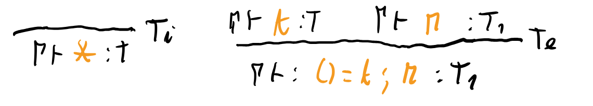

##### Definizione come tipo algebrico

$$
\text{type } \mathbb{1} = *: \mathbb{1}
$$

#### Bottom

$$
F ::= \dots \mid \bot
$$

$$
T ::= \dots \mid \empty
$$

$$
t ::= \dots \mid \text{abort } t \mid \text{raise }e \mid \text{assert} \mid \text{match } t \text{ with}
$$

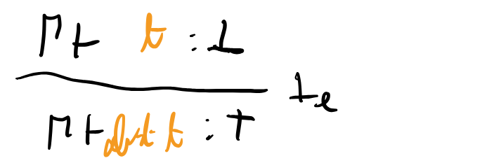

##### Definizione come tipo algebrico

$$
\text{type } \empty =
$$

Tipo privo di abitanti.

## Logica proposizionale al secondo ordine

$$
F ::= \dots \mid \forall \alpha. F \mid \exists  \alpha. F \quad \text{con } \alpha \text{ variabile proposizionale}
$$

$$
T ::= \dots \mid \forall \alpha. T \mid \exists  \alpha. T
$$

$$
t ::= \dots \mid \boxed{t} \mid \boxed{x} = M;t
$$

La SOL è sintatticamente simile alla FOL. La differenza risiede in ciò su cui
agiscono i quantificatori $\to$ nella FOL si quantifica sugli oggetti, nella
SOL invece si quantifica sulle formule. $\to$ più espressiva.

I termini vengono definiti alla Curry $\to$ aggiungo il tipaggio, ma il
linguaggio **non** cambia $\to$ posso applicare ad uno stesso programma
due sistemi di tipi differenti, a seconda del grado di approssimazione
che desidero.

### Regole di introduzione e eliminazione per $\forall$

$$
\frac{\Gamma \vdash t : F\{\beta / \alpha \}}{\Gamma \vdash t : \forall\alpha. F} \quad \forall_i \quad \quad \beta \not \in \text{FV}(M)
$$

Per dimostrare il $\forall$ mi riduco a dimostrare $F$ con una generica $\beta$ (non ho assunzioni al riguardo) al posto di $\alpha$ in $F$.

$$
\frac{\Gamma \vdash t : \forall\alpha. F}{\Gamma \vdash t : F\{G/\alpha\}} \quad \forall_e
$$

Se la formula $F$ vale per tutte le $\alpha$, allora continuerà a valere anche per una generica formula
$G$ al posto di $\alpha$.

#### Applico l'isomorfismo

Applicando l'isomorfismo di Curry-Howard-Kolmogorov alle regole per $\forall$ si ottiene il **polimorfismo**.
Grazie all'isomorfismo è possibile tipare il termine $\lambda x.xx$ che non era tipabile in lambda calcolo tipato semplice.

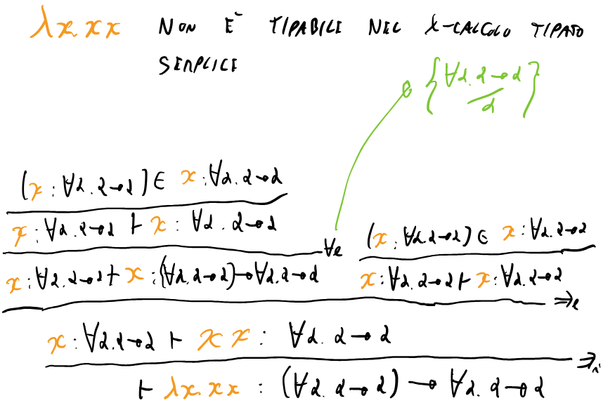

Tuttavia il termine $(\lambda x.xx)(\lambda x.xx)$ **non è tipabile** con le regole a nostra disposizione.
Come succedeve andando a tipare $\lambda x.xx$ in $\lambda$-calcolo tipato semplice ho un mismatch $\to$
da una parte il mio termine deve avere tipo _con la freccia_, dal'altro no.

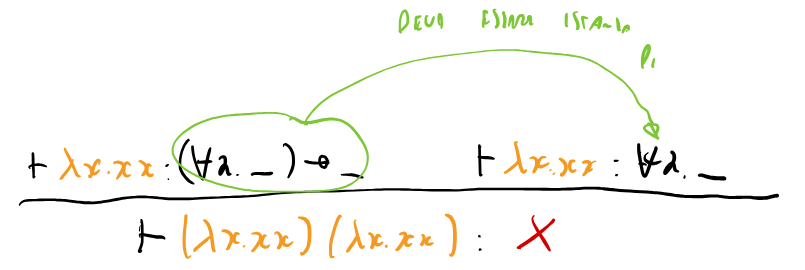

### System F e ADT

La codifica dei tipi vista e poi _cancellata_ a inizio corso usava proprio il system F.

Esempi:

$\mathbb{B} = \forall \alpha. \alpha \to \alpha \to \alpha$

$\mathbb{N} = \forall \alpha. \alpha \to (\mathbb{N} \to \alpha) \to \alpha$

$\empty = \forall \alpha . \alpha$

Il tipo vuoto è il tipo delle funzioni con output polimorfo e input assente $\to$ non ho casi per il pattern
matching.

Esempio particolare

$\forall \alpha . \mathbb{B} \to \alpha$

Funzione che prende in input un booleano e ritorna un valore polimorfo $\to$ funzione che diverge
poiché per rispettare la dichiarazione di tipo deve richiamare sè stessa.

Il tipaggio polimorfico permette di avere una chiara descrizione di cosa fa la funzione.

### Regole di introduzione e eliminazione per $\exists$

A differenza dell'universale, aggiundo le regole esistenziali, sono obbligato a modificare il linguaggio.

$$
\frac{\Gamma \vdash t : F\{G / \alpha \}}{\Gamma \vdash \boxed t : \exists  \alpha. F} \quad \exists _i
$$

Per dimostrare $\exists$ mi riduco a dimostrare $F$ con una qualche $G$ al posto di $\alpha$ in $F$.

$$
\frac{\Gamma \vdash m: \exists  \alpha.F \quad \quad \Gamma, x:F\{\beta/\alpha\} \vdash t: G}{\Gamma \vdash \boxed x = m; t : G} \quad \exists _e
\quad \beta \not \in \text{FV}(\Gamma) \cup \text{FV}(G)
$$

Se ho $m$ che ha tipo astratto $\exists  \alpha . F$ e un codice $t$ di tipo $G$, sapendo che
$x$ è un'implementazione concreta di $m$, che non dipende dalle ipotesi o dal codice, allora
sarò sicuro che $x$ è ottenibile solo dal tipo di dato astratto.

L'operatore $\boxed .$ rimuove informazioni su quale sia effettivamente il tipo $F$.

#### Applico l'isomorfismo

Applicando l'isomorfismo di Curry-Howard-Kolmogorov aggiungo i **tipi di dato astratti**.

Esempio: Stack

$$
\begin{aligned}
& \exists . \text{Stack}. \\
& \text{Stack} \\
& \times (\alpha \to \text{Stack} \to \text{Stack}) \quad \quad \quad \text{push} \\
& \times (\alpha \to (\alpha \times \text{Stack}) + 1) \quad \quad \quad \text{pop}\\
\end{aligned}
$$

Applicando a regola di eliminazione, trovo una implementazione concreta del tipo di dato astratto.

$$
\begin{aligned}
& \boxed x = c; \\
& \langle \text{empty, push, pop} \rangle = x; \\
\end{aligned}
$$

Ora posso usare $\text{empty, push, pop}$ nel mio codice.

## Proprietà approssimata dal sistema di tipi.

System F **non** tipa $(\lambda x.xx)(\lambda x.xx)$ che è il più piccolo termine divergente $\to$
operatore di punto fisso applicato all'identità.

La proprietà approssimata è la **normalizzazione forte**.

### Teorema di normalizzazione forte

$$
\forall \Gamma, t,T. \Gamma \vdash T:t \implies t \text{ è fortemente normalizzante}
$$

Il $\lambda$-calcolo tipato è fortemente normalizzante.

### Corollario

> $\lambda$-calcolo tipato **non** è Turing completo.

Infatti $(\lambda x.xx)(\lambda x.xx)$ è istanza di $Y = (\lambda x.f(xx))(\lambda x.f(xx))$ che
**non** è tipabile.

#### Rendere $\lambda$-calcolo tipato Turing completo

Si aggiunge una regola assiomatica al type system per tipare $Y$ $\to$
$Y: \forall \alpha. (\alpha \to \alpha) \to \alpha$.

#### Dimostrazione del teorema di normalizzazione forte

> Primo tentativo errato

La dimostrazione procede per induzione strutturale su $t$:

- caso $x$:

  Se ho una variabile allora l'unico modo per ottenerla è tramite la regola seguente:

  $$
  \frac{x:T \in \Gamma}{\Gamma \vdash x:T}
  $$

  Non si possono più applicare regole per estendere verso l'alto la derivazione quindi $x$ è
  fortemente normalizzante.

- caso $\lambda x.M$:

  Se mi ritrovo in questa casistica allora significa che la seguente regola è stata applicata:

  $$
  \frac{\Gamma , x: T_1 \vdash M: T_2}{\Gamma \vdash \lambda x.M : T_1 \to T_2}\to_i
  $$

  La dimostrazione si conclude con successo dal momento che per ipotesi induttiva $M$ è
  fortemente normalizzante.

- caso $M N$:

  Significa che la seguente regola è stata utilizzata:

  $$
  \frac{\Gamma \vdash M: T_1 \to T_2 \quad \quad \Gamma \vdash N:T_1}{\Gamma \to M N: T_2}\to_e
  $$

  Per ipotesi induttiva $M$ e $N$ sono entrambi fortemente normalizzanti.
  Ci si accorge subito che non si riesce a mostrare che $M N$ è normalizzante. Questo si verifica
  perché la normalizzazione (sia forte che debole) **non è modulare**.

  **Controesempio**
  $M = N = \lambda x.xx$

### Riducibilità

Visto l'impossibilità di dimostrare la normalizzazione forte, emerge che il sistema di tipi approssima
un'altra proprietà: la **riducibilità** $\to$ una versione _indebolita_ della normalizzazione che ha
la peculiarità di essere modulare.

Occorre dare una definizione più stringente di questa nuova proprietà $\to$ la combinazione degli
elementi deve rispettare il tipaggio degli elementi:

$$
\begin{aligned}
& \text{Riducibile di Tipo T} = \text{ fortemente normalizzante } \land \text{ tipato con tipo T } \land \\
& \text{  combinandolo con altri riducibili di tipo compatibile rimane riducibile } \\
\end{aligned}
$$

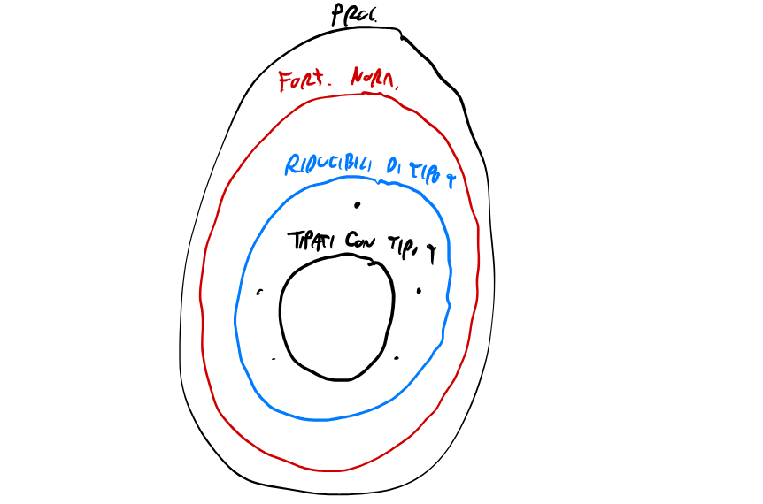

#### Definizione: riducibile di tipo T ($\lambda$-calcolo tipato semplice)

$$T ::= \alpha \mid T \to T$$
$$\text{RID}_{\alpha} = \{t \mid \Gamma \vdash t: \alpha \land t \in SN\}$$
$$\text{RID}_{T_1 \to T_2} = \{t \mid \Gamma \vdash t: T_1 \to T_2 \land t \in SN \land \forall N \in \text{RID}_{T_1}. t N \in \text{RID}_{T_2} \}$$

Con questa nuova nozione della proprietà è possibile portare a termine la dimostrazione
precedentemente fallita.

# Fondamenti Logici dell'Informatica (Modulo 2)

## Verifica di sistemi reattivi - logiche temporali

L'utilizzo di testing per verificare la corretteza di sistemi concorrenti e/o
distribuiti:

- numero di test finiti
- difficile fare test esaustivi
- il testing mostra la presenza di bug, **ma non l'assenza**.

Sistemi critici richiedono soluzioni differenti dal testing classico.

### Model Checking

- utilizzo di logiche per specificare il comportamento di un programma $\to$
  realizzazione di tool che verificano se il **modello** soddisfa le **specifiche**.
- sistemi complessi si possono evolvere nel tempo $\to$ servono logiche in grado
  di codificare dinamiche temporali come "mai", "prima o poi", "successivo".

> Nota: spesso modelli complessi vengono modellati come sottomodelli separati, in
> questo caso serve unirli nuovamente in un unico modello, in modo da poter ragionare
> correttamente su di esso.

### Esempi di proprietà desiderate

- **Safety** $\to$ non succede **mai** nulla di male
- **Progress** $\to$ il sistema può **sempre** evolvere
- **Liveness** $\to$ **prima o poi** capita qualcosa di buono

Il tempo gioca un ruolo centrale.

### Strutture di Kripke

Una **Struttura di Kripke** è quadrupla ($S$, $s_0$, $R$, $L$) dove:

- $S$ è un insieme di **stati**
- $s_0$ è lo **stato iniziale**
- $R \subset S \times S$ è la **relazione di transizione**
- $L: S \to\phi(AP)$ è una **funzione di etichettatura** che indica quali
  proposizioni atomiche sono vere in ogni stato.

Con $S$ finito per motivi di decidibilità.
Notazione: $s \to t$ per indicare $(s,t) \in R$.

### Cammini

Sequenza finita di stati che inizia da $s_0$ tc $\forall i. s_i \to s_{i+1}$.

Ogni cammino è una possibile soluzione del sistema, si considerano solo cammini **infiniti**
dal momento che la relazione di transizione è **totale** $\to$ ogni stato ha sempre una
possibile transizione in uscita.

#### Suffisso

Per n-esimo suffisso di un cammino $\pi$ si intende il cammino al quale sono stati rimossi
i primi n passi e si indica con $\pi^n$.

> Nota: $\pi^0 = \pi$

## Logica Temporale Lineare - LTL

$$
F,G ::= P \mid F \land G \mid F \lor G \mid \lnot F \mid \mathbf{X} F \mid \mathbf{F} F
\mid \mathbf{G} F \mid F \mathbf{U} G
$$

- $P$ è una proposizione atomica
- $\mathbf{ F X G U }$ sono **connettivi temporali**, in particolare:
  - $\mathbf{X}$ $\to$ neXt $\to$ prossimo
  - $\mathbf{G}$ $\to$ Globally $\to$ sempre
  - $\mathbf{F}$ $\to$ Future $\to$ prima o poi
  - $\mathbf{U}$ $\to$ Until $\to$ finché

### Semantica

$$
\textbf{Il cammino } \pi \text{ soddisfa la formula } F \text{ nella struttura di Kripke } \mathcal{M}
$$

$$
\mathcal{M}, \pi \models F
$$

$$
\begin{aligned}
& (S, s, R, L), t,\pi \models P \Longleftrightarrow P \in L(t) \\
& \mathcal{M}, \pi \models F \land G \Longleftrightarrow \mathcal{M}, \pi \models F \text{ e } \mathcal{M}, \pi \models G \\
& \mathcal{M}, \pi \models F \lor G \Longleftrightarrow \mathcal{M}, \pi \models F \text{ oppure } \mathcal{M}, \pi \models G \\
& \mathcal{M}, \pi \models \neg F \Longleftrightarrow \text{non è vero che } \mathcal{M}, \pi \models F \\
& \mathcal{M}, \pi \models \mathbf{X} F \Longleftrightarrow \mathcal{M}, \pi^{1} \models F \\
& \mathcal{M}, \pi \models \mathbf{G} F \Longleftrightarrow \mathcal{M}, \pi^{i} \models F \text{ per ogni } i \in \mathbb{N} \\
& \mathcal{M}, \pi \models \mathbf{F} F \Longleftrightarrow \mathcal{M}, \pi^{i} \models F \text{ per almeno un } i \in \mathbb{N} \\
& \mathcal{M}, \pi \models F \mathbf{U} G \Longleftrightarrow \text{se esiste } i \in \mathbb{N} \text{ tale che } \mathcal{M}, \pi^{i} \models G \\
&\quad \text{e } \mathcal{M}, \pi^{j} \models F \text{ per ogni } 0 \le j < i \\
\end{aligned}
$$

$$
\text{La struttura di Kripke }
\mathcal{M} = (S, s, R, L)
\text{ soddisfa la formula } F
$$

$$
\mathcal{M} \models F
\Longleftrightarrow
\mathcal{M}, \pi \models F
\text{ per ogni cammino } \pi \text{ che inizia da } s
$$

LTL usa implicitamente una quantificazione universali sui cammini $\to$ per verifica di
condizioni esistenziali utilizzo la **negazione**.

### Modellazione e validazione di un sistema tramite LTL

#### Prima versione del modello

Si vuole modellare un sistema in cui Alice e Bob possono fare uscire i rispettivi gatto
e cane nel giardino condiviso, senza che i due animali si incontrino $\to$ utilizzo di
due luci (una per attore) che vengono accese dai due attori per orchestrare la presenza dei
rispettivi animali nel giardino.

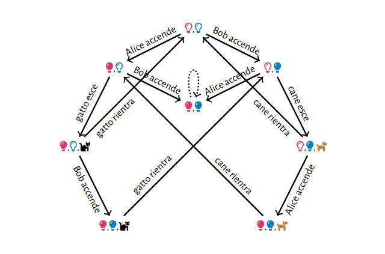

##### Formulazione proprietà tramite LTL

- > Alice e Bob riescono _sempre_ ad accendere la propria luce, se è spenta.
- > Alice e Bob riescono _sempre_ a spegnere la propria luce, se è accesa.

$$
\mathbf{G}(S_B \implies \mathbf{F}(A_B)) \quad \mathbf{G}(S_A \implies \mathbf{F}(A_A))
$$

$$
\mathbf{G}(A_B \implies \mathbf{F}(S_B)) \quad \mathbf{G}(A_A \implies \mathbf{F}(S_A))
$$

dove:

- $S_A \equiv  \text{Luce di Alice spenta}$
- $S_B \equiv  \text{Luce di Bob spenta}$
- $A_A \equiv  \text{Luce di Alice accesa}$
- $A_B \equiv  \text{Luce di Bob accesa}$

Queste proprietà **non** sono soddisfatte in quanto Alice o Bob potrebbero ripetere in loop
il seguente cammino:
$$\text{accensione luce} \to \text{animale esce} \to \text{animale rientra}$$
La proprietà di **progress** non è rispettata in questo modello.

- > se Alice accende la propria luce, prima o poi il gatto esce
- > se Bob accende la propria luce, prima o poi il cane esce

$$
\mathbf{G}(A_A \implies \mathbf{F} G)
$$

$$
\mathbf{G}(A_B \implies \mathbf{F} D)
$$

dove:

- $G \equiv  \text{Gatto di Alice}$
- $D \equiv  \text{Cane di Bob}$

Anche queste proprietà non vengono rispettate $\to$ Alice e Bob accendono insieme. $\to$
deadlock.

Questo modello **non** soddisfa la proprietà di liveness.

##### Miglioramento del modello

Il problema principale è dato dalla simmetria nei cammini che i due attori possono intraprendere
all'interno del modello $\to$ occorre introdurre un comportamento differente per un attore
affinché uno abbia priorità rispetto l'altro.

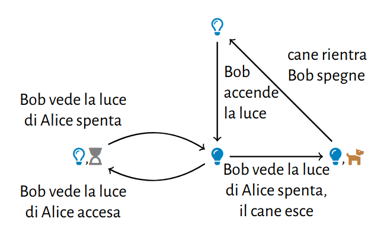

Introducendo il comportamento soprastante Alice ha priorità su Bob.

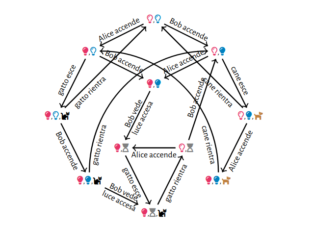

Rispetto alla prima versione del modello si può osservare un miglioramento $\to$ la
**liveness** è garantita per Alice. Le altre proprietà rimangono non soddisfatte.

LTL fissa le scelte degli attori nel sistema per esaminare un cammino specifico per volta.
$\to$ affiancata da altre logiche che consentono di esaminare i cammini universalmente.

#### Proprietà di non alternanza

Sistemi che proteggono la mutua esclusione tramite alternanza fissata sono banali e
introducono assenza di **garanzia di progresso**.

> C'è un cammino lungo il quale Alice e Bob non si alternano ?

Che diventa:

> è falso che in ogni cammino Alice e Bob si alternano sempre.

Formula LTL:

$$
\mathbf{G}(G \implies \mathbf{F}(\lnot G \land \lnot G \mathbf{U} D) )
$$

> "Se il gatto è in cortile allora dopo un po' il gatto non è più in cortile e non
> lo è più fino a quando compare il cane".

## Computational Tree Logic - CTL

### Limitazioni di LTL

- quantificazione universale su tutti i cammini
- non tutte le proprietà che verificano l’esistenza di un cammino con
  certe caratteristiche possono essere espresse
- proprietà che mescolano quantificazione universale ed
  esistenziale sui cammini **non sono esprimibili in LTL**
- **logiche branching time** $\to$ introducono operatori di quantificazione sui cammini
  $\mathbf{A}$ e $\mathbf{E}$, rispettivamente universale ed esistenziale.
- “branching time” = ragionare sull’insieme dei cammini possibili,
  piuttosto che su ciascuno preso individualmente come fa LTL.

### Sintassi CTL

$$
F,G ::= P \mid F \land G \mid F \lor G \mid \lnot F \mid \Omega \mathbf{X} F \mid \Omega \mathbf{F} F
\mid \Omega \mathbf{G} F \mid \Omega [F \mathbf{U} G]
$$

$$
\Omega ::= \mathbf{A} \mid \mathbf{E}
$$

dove:

- $\mathbf{A}$ = "per ogni cammino"
- $\mathbf{E}$ = "esiste un cammino"

> **Nota!!** Il quantificatore precede **immediatamente** il connettivo temporale.

### Semantica CTL

$$
\textbf{Lo stato s} \text{ soddisfa la formula } F \text{ nella struttura di Kripke } \mathcal{M}
$$

$$
\mathcal{M}, s \models F
$$

$$
\begin{aligned}
& (S, s, R, L), t \models P \Longleftrightarrow P \in L(t) \\
& \mathcal{M}, s \models F \land G \Longleftrightarrow \mathcal{M}, s \models F \text{ e } \mathcal{M}, s \models G \\
& \mathcal{M}, s \models F \lor G \Longleftrightarrow \mathcal{M}, s \models F \text{ oppure } \mathcal{M}, s \models G \\
& \mathcal{M}, s \models \neg F \Longleftrightarrow \text{non è vero che } \mathcal{M}, s \models F \\
& \mathcal{M}, s \models \mathbf{A} \mathbf{X} F \Longleftrightarrow \forall s' \text{ tc } s \to s'.\mathcal{M}, s' \models F \\
& \mathcal{M}, s \models \mathbf{E} \mathbf{X} F \Longleftrightarrow \exists s' \text{ tc } s \to s' \text{ e } \mathcal{M}, s' \models F \\
& \mathcal{M}, s_0 \models \mathbf{A} \mathbf{G} F \Longleftrightarrow \forall \text{ cammino } s_0 \to s_1 \to s_2 \to \dots \text{ si ha } \mathcal{M}, s_i \models F \quad \forall i \in \mathbb{N} \\
& \mathcal{M}, s_0 \models \mathbf{E} \mathbf{G} F \Longleftrightarrow \exists \text{ cammino } s_0 \to s_1 \to s_2 \to \dots \text{ tc } \mathcal{M}, s_i \models F \quad \forall i \in \mathbb{N} \\
& \mathcal{M}, s_0 \models \mathbf{A} \mathbf{F} F \Longleftrightarrow \forall \text{ cammino } s_0 \to s_1 \to s_2 \to \dots \exists i \in \mathbb{N} \text{ tc } \mathcal{M}, s_i \models F \\
& \mathcal{M}, s_0 \models \mathbf{E} \mathbf{F} F \Longleftrightarrow \exists  \text{ cammino } s_0 \to s_1 \to s_2 \to \dots \exists i \in \mathbb{N} \text{ tc } \mathcal{M}, s_i \models F \\
& \mathcal{M}, s \models \mathbf{A} [F \mathbf{U} G] \Longleftrightarrow \forall \text{ cammino } s_0 \to s_1 \to s_2 \to \dots \exists i \in \mathbb{N} \text{ tc } \\
& \quad \mathcal{M}, s_i \models G \text{ e } \mathcal{M, s_j} \models F \quad \forall 0 \leq j < i \\
& \mathcal{M}, s \models \mathbf{E} [F \mathbf{U} G] \Longleftrightarrow \exists \text{ cammino } s_0 \to s_1 \to s_2 \to \dots \exists i \in \mathbb{N} \text{ tc } \\
& \quad \mathcal{M}, s_i \models G \text{ e } \mathcal{M, s_j} \models F \quad \forall 0 \leq j < i \\
\end{aligned}
$$

Di seguito alcune raffigurazioni che semplificano il confronto fra alcuni operatori poco
intuitivi.

#### $\mathbf{A} \mathbf{G}$ vs $\mathbf{E} \mathbf{G}$

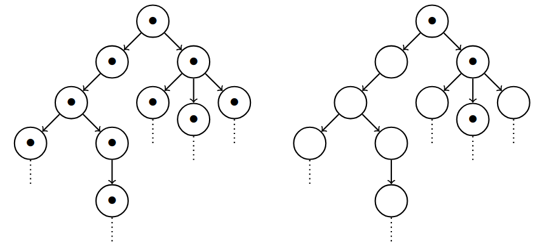

#### $\mathbf{A} \mathbf{F}$ vs $\mathbf{E} \mathbf{F}$

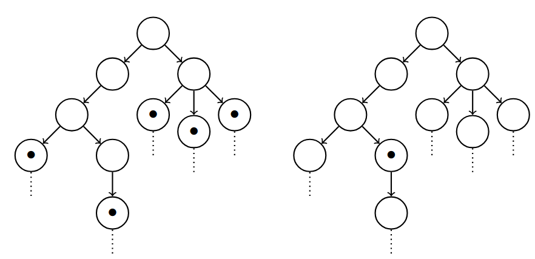

### Potere espressivo di LTL e CTL

LTL e CTL sono **incomparabili** dal punto di vista del poter espressivo.

Sembra chiaro che CTL può esprimere proprietà che LTL non può, tuttavia esistono proprietà
esprimibili in LTL, ma non in CTL.

#### Esempio di proprietà esprimibile in LTL, ma non in CTL

Si consideri $\mathbf{F}(\mathbf{G}p)$:


- $\mathbf{F}(\mathbf{G}p)$ è falsa $\to$ esiste almeno un cammino in cui non è vera (
  es. $q_0 q_1 \dots$)
- $\mathbf{AF}(\mathbf{EG}p)$ è vera

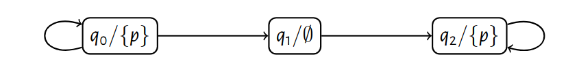

- $\mathbf{F}(\mathbf{G}p)$ è vera $\to$ ho solo due cammini possibili:
  - $q_0 q_0 \dots$
  - $q_0 q_0 \dots q_0 q_1 q_2 q_2 q_2 \dots$

- $\mathbf{AF}(\mathbf{AG}p)$ è false $\to$ un cammino passa attraverso $q_1$ dove $p$
  non vale

#### Esempio di proprietà non esprimibile in LTL

**Teorema:** Non esiste alcune formula LTL equivalente a $\mathbf{AG}(\mathbf{EF}p)$

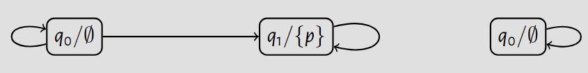

**Dimostrazione**:

- Si suppone che esista un formula LTL $F$ equivalente a $\mathbf{AG}(\mathbf{EF}p)$
- Il modello a sinistra soddisfa $\mathbf{AG}(\mathbf{EF}p)$
- $\mathbf{AG}(\mathbf{EF}p) \equiv F$ $\to$ il modello a sinistra deve soddisfare $F$
- I cammini nel modello di destra sono cammini nel modello di sinistra
- Segue che il modello a destra soddisfa $F$ ($F$ vera in tutti gli stati del modello a
  sinistra $\to$ cammini a destra sono sottoinsieme di quelli a sinistra $\to$ F vera in tutti gli
  stati del modello a destra)
- Il modello a destra non soddisfa $\mathbf{AG}(\mathbf{EF}p)$ $\to$ assurdo $\to$ cvd

## Model Checker per CTL

Le regole più complesse su cui fare model checking sono quelle dalla settima in poi poiché sono
possibili **infiniti cammini** (gli stati sono **finiti**).

### Formulazione del problema

Formulazione classica:

> Dato un modello $\mathcal{M} = (S, s_0, R, L)$ e una formula $F$, stabilire se $\mathcal{M} \models F$.

Formulazione alternativa:

> - Dato un modello $\mathcal{M} = (S, s_0, R, L)$ e una formula $F$, calcolare il più grande sottoinsieme
>   $X$ di $S$ tale che $\mathcal{M}, s \models F$ per ogni $s \in X$.
> - $\mathcal{M \models F}$ sse $s_o \in X$

La seconda formulazione sfrutta la finitezza degli stati per dari una semantica alternativa.
Il sottoinsieme di stati $X$ della definizione, viene indicato con $[[F]]$-

#### Definizione di $[[F]]$

La definizione è per induzione sulla grammatica della logica.

La logica ha numero elevato di operatori, che rendono più complessa la definizione per induzione.
Viene quindi scelto un **insieme adeguato di connettivi** $\to$ un sottoinsieme dei connettivi originali
della logica tale che permette di riscrivere **tutte** le formule della logica usando solo quei connettivi.

##### Teorema

L'insieme di connettivi $\{\mathbf{EX}, \mathbf{AF}, \mathbf{EU}\}$ è adeguato

**Dimostrazione**

- $\mathbf{AX} F \equiv \lnot\mathbf{EX}\lnot F$
- $\mathbf{EF} F \equiv \mathbf{E}[\top \mathbf{U} F]$
- $\mathbf{EG} F \equiv \lnot\mathbf{AF}\lnot F$
- $\mathbf{AG} F \equiv \lnot\mathbf{EF}\lnot F$
- $\mathbf{A}[F \mathbf{U} G] \equiv \lnot(\mathbf{E}[\lnot G \mathbf{U} (\lnot F \land \lnot G)] \lor \mathbf{EG} \lnot G)$

##### Definizione di $\mathbf{EX}F$

Si definisce quindi $[[\mathbf{EX} F]] = \text{pre}[[F]]$ dove $\text{pre}$ è la **preimmagine**:

$$
\text{pre}(X) \stackrel{def}{=} \{s \in S \mid \exists  t \in X: R(s,t)\}
$$

> **Intuizione**: la preimmagine è l'insieme di quegli stati dai quali posso essere partito per arrivare allo
> stato corrente in un passo.

##### Definizione di $\mathbf{AF}F$

Per definire $[[\mathbf{AF}F]]$ prendiamo prima in considerazione la formulazione di ricorsiva della formula.

$$
\mathbf{AF}F \equiv F \lor \mathbf{AXAF} F
$$

Espandendo questa formulazione troviamo la definizione:

$$
\begin{aligned}
& [[\mathbf{AF}F]]  \\
& = [[F \lor \mathbf{AXAF}F]] \\
& = [[F]] \cup [[\mathbf{AXAF}F]] \\
& = [[F]] \cup [[\lnot \mathbf{EX}\lnot \mathbf{AF}F]] \\
& = [[F]] \cup (S \setminus [[\mathbf{EX} \lnot \mathbf{AF} F]]) \\
& = [[F]] \cup (S \setminus \text{pre}[[\lnot \mathbf{AF} F]]) \\
& = [[F]] \cup (S \setminus \text{pre}(S \setminus pre([[\mathbf{AF} F]])) \\
\end{aligned}
$$

Per terminare serve calcolare l'equazione $[[\mathbf{AF}F]] = [[F]] \cup (S \setminus \text{pre}(S \setminus pre([[\mathbf{AF} F]]))$
che è un problema di **punto fisso**.

###### Teorema (Minimo punto fisso nel caso finito)

Si tratta di una caso particolare del **punto fisso di Kleene**.

Sia $A$ un insieme finito e sia $\mathcal{F}: \wp(A) \to \wp(A)$ una funzione **monotona**. Allora esiste $k$
tale che $\mathcal{F}^k(\empty)$ è il **più piccolo punto fisso** di $\mathcal{F}$, che viene denotato con $\mu \mathcal{F}$.

Il teorema mi dice che, applicando $\mathcal{F}$ per un numero finito di volte, a partire da $\empty$, arriverò a
ottenere un insieme finito di elementi che non crescerà più. Questo insieme è il più piccolo punto fisso.
Il vantaggio è che è calcolabile in modo **totalmente programmatico**.

$\wp(A)$ $\to$ insiemi finiti di elementi

Grazie a questo teorema possiamo completare la definizione:

$$
[[\mathbf{AF}F]] = \mu \mathcal{F} \quad \text{dove} \quad \mathcal{F}(X) = [[F]] \cup (S \setminus \text{pre}(S \setminus X))
$$

> **Nota**: $\mathcal{F}$ è **monotona** (quindi valie il teorema) $\to$ vene applicato un numero pari di
> differenze.

##### Definizione di $\mathbf{E}[F \mathbf{U} G]$

Anche qui prendiamo in considerazione la formulazione ricorsiva della formula.

$$
\mathbf{E}[F \mathbf{U} G] \equiv G \lor (F \land \mathbf{EXE}[F \mathbf{U} G])
$$

Conti con la nuova formulazione:

$$
\begin{aligned}
& [[\mathbf{E}[F \mathbf{U} G]]] \\
& = [[G \lor (F \land \mathbf{EXE}[F \mathbf{U} G])]] \\
& = [[G]] \cup [[F \land \mathbf{EXE}[F \mathbf{U} G]]] \\
& = [[G]] \cup ([[F]] \cap [[\mathbf{EXE}[F \mathbf{U} G]]]) \\
& = [[G]] \cup ([[F]] \cap \text{pre}[[\mathbf{E}[F \mathbf{U} G]]]) \\
\end{aligned}
$$

Quindi:

$$
[[\mathbf{E}[F \mathbf{U} G]]] = \mu \mathcal{F} \quad \text{dove} \quad \mathcal{F}(X) = [[G]] \cup ([[F]] \cap \text{pre}(X))
$$

## Logica Lineare

### Il teorema $A \to (A \to B) \to A \land B$

In logica classica la formula soprastante è un teorema. Dargli un'interpretazione sensata è molto semplice:

- $A = \text{ipotesi}$ $\to$ _n è multiplo di 6_
- $A \to B = \text{teorema}$ $\to$ _se n è multiplo di 6, allora n non è primo_
- $A \land B = \text{tesi}$ $\to$ _n è multiplo di 6 e n non è primo_

Tuttavia quando si ragione con delle **risorse** emergono dei problemi:

- $A = \text{stato iniziale}$ $\to$ _ho un euro_
- $A \to B = \text{distributore automatico}$ $\to$ _consumo un euro e produco un caffé_
- $A \land B = \text{stato finale}$ $\to$ _ho un euro e un caffé_

La conclusione ottenuta non va bene, non rispetta la semantica del sistema &rarr; causato dall'utilizzo multiplo
delle ipotesi nella dimostrazione del teorema $\to$ utilizzo **non lineare** delle ipotesi.

Intuitivamente una risorsa può essere consumata una sola volta.

### Due congiunzioni

In logica delle risorse ci sono due congiunzioni: **additiva** e **moltiplicativa**.

**Congunzione additiva**

$$
\dfrac{\Gamma \vdash A \quad \Gamma \vdash B}{\Gamma \vdash A \land B}
$$

Significa che con $\Gamma$ è possibile ottenere sia $A$ che $B$ separatamente.

**Congunzione moltiplicativa**

$$
\dfrac{\Gamma \vdash A \quad \Delta\vdash B}{\Gamma, \Delta \vdash A \land B}
$$

### Weakening e Contraction

- **Weakening**

$$
\dfrac{\Gamma \vdash A}{\Gamma, B \vdash A}
$$

- **Contraction**

$$
\dfrac{\Gamma, B, B \vdash A}{\Gamma, B \vdash A}
$$

Queste regole in logica sono intuitive $\to$ le ipotesi sono verità e **riutilizzabili** quando serve.
Tramite queste 2 regole in logica classica è possibile derivare una congiunzione dall'altra e viceversa $\to$ in logica
tradizionale non c'è differenza tra le due.

#### Da congiunzione additiva a moltiplicativa

$$
\dfrac{\dfrac{\Gamma \vdash A}{\Gamma, \Delta \vdash A}\text{weakening} \quad \quad \quad \dfrac{\Delta \vdash B}{\Gamma, \Delta \vdash B}\text{weakening}}{\Gamma, \Delta \vdash A \land B}\land \text{ additiva}
$$

#### Da congiunzione moltiplicativa a additiva

$$
\dfrac{\Gamma \vdash A \quad \quad \Gamma \vdash B}{\dfrac{\Gamma , \Gamma \vdash A \land B}{\Gamma \vdash A \land B}\text{contraction}}\land \text{moltiplicativa}
$$

### Formule della logica lineare

$$
A,B ::= \mathbf{1} \mid \bot \mid \top \mid \mathbf{0}\mid A \otimes B \mid A \wp B \mid A \,\&\, B \mid A \oplus B
$$

|                | Congiunzione | Disgiunzione | Unità        | Unità        |
| -------------- | ------------ | ------------ | ------------ | ------------ |
| moltiplicativa | $\otimes$    | $\wp$        | $\mathbf{1}$ | $\bot$       |
| additiva       | $\&$         | $\oplus$     | $\top$       | $\mathbf{0}$ |

Gergo:

- $\otimes$ = _tensore_ o _per_
- $\wp$ = _par_
- $\&$ = _with_
- $\oplus$ = _plus_ _più_

Nonostante il nome fuorviante _par_, il'operatore che realizza il parallelismo è il tensore. Questa sintassi descrive il
frammento MALL (Multiplicative, Additive Linear Logic) che è **privo di negazione** &rarr; non serve la negazione
esplicita in quanto in logica lineare c'è il concetto di **dualità**.

### Dualità

Se $A$ significa "scelgo/produco", allora $A^{\bot}$ significa "offro/consumo" (e viceversa).

$$
\begin{aligned}
& (\mathbf{1})^\perp = \bot \\
& (\bot)^\perp = \mathbf{1} \\
& (\top)^\perp = \mathbf{0} \\
& (\mathbf{0})^\perp = \top \\[0.5em]
& (A \otimes B)^\perp = A^\perp \wp B^\perp \\
& (A \wp B)^\perp = A^\perp \otimes B^\perp \\
& (A \,\&\, B)^\perp = A^\perp \oplus B^\perp \\
& (A \oplus B)^\perp = A^\perp \,\&\, B^\perp
\end{aligned}
$$

La dualità è un'**involuzione** $\to A^{\bot \bot} = A$ per ogni $A$.

### Sequenti

#### 1. Logica Intuizionista (Modello Asimmetrico)

Il sequente è:
$$ A_1, \dots, A_n \vdash B $$
Che è equivalente a dire:
$$ A_1 \land \dots \land A_n \vdash B $$

- **Significato:** Se ho tutte le input $A$ (congiunzione $\land$), allora posso produrre $B$.
- A destra del simbolo $\vdash$ (turnstile) c'è **una sola formula** ($B$).
- **Interpretazione Informatica (Asimmetrica):**
  - Questo rappresenta una **funzione**.
  - Le $A$ sono gli **argomenti** (input) della funzione.
  - La $B$ è il **valore di ritorno** (output).
  - È "asimmetrico" perché puoi avere molti input ma restituisci sempre **un solo risultato**.

#### 2. Logica Lineare Classica (Modello Simmetrico)

Il sequente è:
$$ A_1, \dots, A_m \vdash B_1, \dots, B_n $$
Che corrisponde a:
$$ A_1 \otimes \dots \otimes A_m \vdash B_1 \wp \dots \wp B_n $$

- **Significato:** Qui i simboli cambiano. A sinistra usiamo il **prodotto tensore** ($\otimes$, una "e"
  forte) e a destra il **Par** ($\wp$, una "o" parallela).
- Ci sono più formule sia a sinistra che a destra ($B_1, \dots, B_n$).
- **Interpretazione Informatica (Simmetrica):**
  - Non più funzioni, ma **processi** o **scambi di risorse**.
  - **Risorse consumate ($A$):** In logica lineare, le ipotesi non sono verità eterne, ma "gettoni" che spendi. Se usi $A$ per ottenere qualcosa, $A$ non c'è più.
  - **Risorse prodotte ($B$):** Il processo non restituisce un solo valore, ma produce un nuovo stato o un insieme di output complessi interagenti.
  - È "simmetrico" perché input e output hanno la stessa struttura "multipla".

#### Logica one-sided

La simmetria della logica lineare consente l'utilizzo di sequenti **_one sided_**:

$$
A_1 , \dots , A_m \vdash B_1 , \dots , B_n \quad \approx \quad \vdash A_1^{\bot}, \dots , A_m^{\bot}, B_1, \dots , B_n
$$

### Regole

#### Costanti

$$
\dfrac{}{\vdash \mathbf{1}}
\qquad
\dfrac{}{\vdash \Gamma, \top}
\qquad
\dfrac{\vdash \Gamma}{\vdash \Gamma, \bot}
\qquad
\text{\textbf{nessuna regola per } } \mathbf{0}
$$

- $\mathbf{1}$ è l'unità moltiplicativa, **significato intuitivo** $\to$ _ho finito_
- $\bot$ è il duale di $\mathbf{1}$, **significato intuitivo** $\to$ _hai finito?_ $\to$ è
  l'attesa di un segnale, poi continua.
- $\top$ è l'unità additiva, **significato intuitivo** $\to$ _cosa scegli tra 0 possibilità_ $\to$
  intepretabile come la descrizione di un programma che va in crash.
- $\mathbf{0}$ è il duale di $\top$, **significato intuitivo** $\to$ _scelgo tra 0 possibilità_ $\to$
  rappresenta un programma impossibile da realizzare

#### Connettivi moltiplicativi

$$
\dfrac{\vdash \Gamma, A \quad \vdash \Delta, B}{\vdash \Gamma, \Delta, A \otimes B}
\qquad
\dfrac{\vdash \Gamma, A, B}{\vdash \Gamma, A \wp B}
$$

- $A \otimes B \to$ **significato intuitivo** $\to$ servono sia $\Gamma$ che $\Delta$ per produrre
  $A$ e $B$ insieme, dato che avevo bisogno di $\Gamma$ per produrre $A$ e che avevo bisogno di $\Delta$
  per produrre $B$. Sia $A$ che $B$ vengono eseguiti in un ordine scelto dall'**esterno**.
- $A \wp B \to$ il _par_ fa le veci della virgola. Entambe le azioni eseguite secondo un ordine **interno**.

#### Connettivi additivi (contesto condiviso)

$$
\dfrac{\vdash \Gamma, A \quad \vdash \Gamma, B}{\vdash \Gamma, A \,\&\, B}
\qquad
\dfrac{\vdash \Gamma, A}{\vdash \Gamma, A \oplus B}
\qquad
\dfrac{\vdash \Gamma, B}{\vdash \Gamma, A \oplus B}
$$

- $A \& B \to$ **significato intuitivo** $\to$ posso ottenere $A$ e $B$ separatamente con le risorse in
  $\Gamma$, ma non posso ottenerli insieme. $\to$ **scelta esterna**, infatti il sistema dev'essere
  pronto per produrre entrambe le scelte con le stesse risorse (non sa a priori quale sarà la scelta).
  Si tratta di un'**offerta** fra due scelte verso l'esterno.
- $A \oplus B \to$ **significato intuitivo** $\to$ scelta **interna** di chi produrre fra $A$ e $B$.

#### Altre regole

$$
\dfrac{}{\vdash A, A^\perp} \text{ assioma}
\qquad
\dfrac{\vdash \Gamma, A \quad \vdash \Delta, A^\perp}{\vdash \Gamma, \Delta} \text{ taglio (o cut)}
$$

- **assioma** $\to$ **significato intuitivo** $\to$ posso produrre solo se consumo.
- **taglio** $\to$ **significato intuitivo** $\to$ interazione fra 2 programmi:
  - uno che produce $A$
  - l'altro che consuma $A$

  La regole del cut può essere messa in relazione con il Modus Ponens:

  $$
  \dfrac{\Gamma \vdash M: A \to B \qquad \Gamma \vdash N : A}{\Gamma \vdash M N :B}
  $$
  - Consumo qualcosa di tipo $A$ per produrre qualcosa di tipo $B$
  - Ho un qualcosa di tipo $A$
  - Ottengo qualcos'altro di tipo $B$

  Va osservato come il tipo $A$ non compaia più, esattamente come la risorsa $A$ non compare più
  con l'applicazione del taglio.

> **Nota:** in logica linerare è fondamentale che i sequenti siano **multinsiemi** di formule, in modo da
> tenere traccia di occorrenze multiple della medesima risorsa.

### Implicazione lineare

$$
A \multimap B \equiv A^{\top} \wp B
$$

Significato:

- consuma $A$ e produco $B$ nell'ordine che voglio $\to$ concettualmente sensato, è così anche con le
  funzioni in informatica.
- questo operatore viene chiamato _lollipop_

#### Coimplicazione lineare

$$
A \circ \mkern-3mu - \mkern-3mu \circ B \equiv (A \multimap B) \otimes (B \multimap A)
$$

### Tentativo di dimostrazione per $A \multimap (A \multimap B) \multimap A \otimes B$

$$
\begin{aligned}
& \textbf{Tentativo 1 (Fallisce su A)} \\
& \dfrac{
    \dfrac{
      \dfrac{}{\vdash A^\perp, A}\text{ax}
      \qquad
      \dfrac{
        \dfrac{?}{\vdash A} \quad \dfrac{}{\vdash B^\perp, B}\text{ax}
      }{\vdash B^\perp, A \otimes B}\otimes
    } {\vdash A^\perp, A \otimes B^\perp, A \otimes B}\otimes
  }{\vdash A^\perp \wp (A \otimes B^\perp) \wp (A \otimes B)} \wp
\end{aligned}
$$

$$
\begin{aligned}
& \textbf{Tentativo 2 (Fallisce su A)} \\
& \dfrac{\dfrac{
    \dfrac{}{\vdash A^\perp, A}\text{ax}
    \qquad
    \dfrac{
        \dfrac{?}{\vdash A} \quad \dfrac{}{\vdash B^\perp, B}\text{ax}
    }{
        \vdash A \otimes B^\perp, B
    }\otimes
}{
    \vdash A^\perp, A \otimes B^\perp, A \otimes B
}\otimes
}{\vdash A^\perp \wp (A \otimes B^\perp) \wp (A \otimes B)} \wp
\end{aligned}
$$

Il fatto di non riuscire a derivare questa formula in logica lineare è un bene $\to$ è la formula corrispondente
al teorema $A \to (A \to B) \to A \land B$ in logica classica.

### Tentativo di dimostrazione per $A \multimap (A \multimap B) \multimap A \,\&\, B$

Analogia: distributore di caffé che nel caso l'utente non volesse più il caffé dopo aver inserito la
moneta, può fornire un rimborso.

$$
\begin{aligned}
\dfrac{
    \dfrac{
        \dfrac{
            \dfrac{}{\vdash A^\perp, A}\text{ax}
            \quad
            \dfrac{?}{\vdash B^\perp, A}
        }{
            \vdash A^\perp, A \otimes B^\perp, A
        }\otimes
        \qquad
        \dfrac{
            \dfrac{}{\vdash A^\perp, A}\text{ax}
            \quad
            \dfrac{}{\vdash B^\perp, B}\text{ax}
        }{
            \vdash A^\perp, A \otimes B^\perp, B
        }\otimes
    }{
        \vdash A^\perp, A \otimes B^\perp, A \,\&\, B
    }\&
}{
    \vdash A^\perp \wp (A \otimes B^\perp) \wp (A \,\&\, B)
}\wp
\end{aligned}
$$

La dimostrazione ad un certo punto fallisce in quanto si osserva che viene prodotto $A$, ma è solo possibile
la consumazione di $B$.

Quando si ha $\vdash A^{\bot}, A \otimes B^{\bot}, A$, $A^{\top}$ indica la moneta incamerata dal distributore,
$A$ indica la moneta che l'utente vuole indietro come rimborso e $A \otimes B^{\bot}$ indica il processo
che trasforma la moneta nel caffé.

Non è possibile concludere la dimostrazione in quanto, se avviene il rimborso, non viene utilizzato il processo
di realizzazione del caffé a partire dalla moneta (il processo è un rirsorsa). L'idea è quindi quella di fornire
un'alternativa a questo processo tramite **scelta esterna** ($\,\&\,$).

### Dimostrazione di $A \multimap (\mathbf{1} \,\&\, (A \multimap B)) \multimap A \,\&\, B$

$$
\begin{aligned}
\dfrac{\dfrac{
    \dfrac{
        \dfrac{
            \dfrac{
               \dfrac{}{\vdash A^\perp, A}\text{ax}
            }{
               \vdash A^\perp, \bot, A
            }\bot
        }{
            \vdash A^\perp, \bot \oplus (A \otimes B^\perp), A
        }\oplus
        \qquad
        \dfrac{\dfrac{
            \dfrac{}{\vdash A^\perp, A}\text{ax}
            \quad
            \dfrac{}{\vdash B^\perp, B}\text{ax}
        }{
            \vdash A^\perp, A \otimes B^\perp, B
        }\otimes
        }{\vdash A^{\bot}, \bot \oplus (A \otimes B^{\bot}), B}\oplus
    }{
        \vdash A^\perp, \bot \oplus (A \otimes B^\perp), A \,\&\, B
    }\&
}{
    \vdash A^\perp \wp (\bot \oplus (A \otimes B^\perp)) \wp (A \,\&\, B)
}\wp
}{\vdash A^\perp \wp (\mathbf{1} \,\&\, (A \multimap B))^\perp \wp (A \,\&\, B)}\equiv
\end{aligned}
$$

### Proprietà della logica lineare

#### Teorema (eliminazione dei taglio)

Se $\vdash \Gamma$ è dimostrabile, esista una prova per $\vdash \Gamma$ che non usa la regola **cut**.

#### Corollario

$\vdash \mathbf{0}$ non è dimostrabile. La logica è consistente.

#### Dimostrazione

Se $\vdash \mathbf{0}$ fosse dimostrabile, lo sarebbe anche senza cut per il teorema precedente.
Significa quindi che è stata utilizzata la regola di introduzione di $\mathbf{0}$, la quale non esiste $\to$
assurdo.

## $\pi$-calcolo

Si tratta di un modello di calcolo per la concorrenza. La versione mostrata dal prof è
leggermente diverso da quello originale.

Questo formalismo si base sul concetto di **canale** $\to$ mezzo di scambio per i messaggi.

### Sintassi

$$
\begin{aligned}
& P, Q ::= x[] & \text{invio segnale}\\
& \mid x().P & \text{ricezione segnale}\\
& \mid x \langle y \rangle .P & \text{invio il canale } y \text{ su } x\\
& \mid x(y).P  & \text{ricevo canale } y \text{ su } x\\
& \mid x\triangleleft \mathbf{b}.P & \text{invio booleano } \mathbf{b} \text{ su canale}\\
& \mid x \triangleright \{P,Q\} & \text{scelta } (\mathbf{b} \in {\mathbf{inl}, \mathbf{inr}}) \\
& \mid P \mid Q & \text{composizione parallela}\\
& \mid (x)P & \text{restrizione}\\
\end{aligned}
$$

- Questa sintassi descrive i **processi** che sono le entità che calcolano e comunicano tramite
  **canali**.
- Il **segnale** è semplicemente un messaggio vuoto, quando il processo in attesa del segnale
  lo riceve, prosegue con la propria esecuzione.
- Come possibile osservare dalla sintassi mostrata, la composizione in $\pi$-calcolo è
  parallela, questo rappresenta una grossa differenza con il $\lambda$-calcolo.
- la **restrizione** agisce come un canale privato riservato al processo $P$.

Esempio restrizione

Nel processo $(x)P \mid x[]$ le due $x$ sono due variabili diverse. La prima è riservata
a $P$ e significa che ogni occorrenza di $x$ in $P$ indicherà il canale creato con la
restrizione.

### Nomi liberi

$$
\begin{aligned}
& \text{fn} (x[]) = \{x\} \\
& \text{fn} (x().P) = \{x\} \cup \text{fn}(P) \\
& \text{fn} (x \langle y \rangle .P) = \{x,y\} \cup \text{fn}(P) \\
& \text{fn} (x(y).P) =  (\{x\} \cup \text{fn}(P)) \setminus \{y\} \\
& \text{fn} (x\triangleleft \mathbf{b}.P) = \{x\} \cup \text{fn}(P) \\
& \text{fn} (x \triangleright \{P,Q\}) = \{x\} \cup \text{fn}(P) \cup \text{fn}(Q) \\
& \text{fn} (P \mid Q) = \text{fn}(P) \cup \text{fn}(Q) \\
& \text{fn} ((x)P) = fn(P) \setminus \{x\} \\
\end{aligned}
$$

### Alcuni esempi di processi

#### Costanti booleane

$$
\text{True}(x) = x \triangleleft \mathbf{inl}.x[]
$$

$$
\text{False}(x) = x \triangleleft \mathbf{inr}.x[]
$$

Le costanti booleane vengono realizzate da processi che inviano un booleano e poi inviano
un segnale di terminazione.

#### Costrutto `not`

$$
\text{Not}(x,y) = x \triangleright \{x().\text{False}\langle y \rangle, x().\text{True}\langle y \rangle\}
$$

Utilizzando le costanti booleane implementate, è facilmente definibile l'opeatore `not`,
che nega il booleano ricevuto su $x$, tramite la **scelta** e lo invia su $y$

#### Costrutto `copy`

Analogamente è possibile definire un operatore `copy` che produce su $y$ quel che riceva su $x$

$$
\text{Copy}(x,y) = x \triangleright \{x().\text{True}\langle y \rangle, x().\text{False}\langle y \rangle\}
$$

Oppure si può dare una definizione alternativa facendo uso di **restrizione** e
**composizione parallela**.

$$
\text{Copy}(x,y) = (z)(\text{Not}(x, z) \mid \text{Not}(z, y))
$$

Qui la restrizione è fondamentale $\to$ se non la usassi avrei una **race condition** sia
in lettura che in scrittura $\to$ dal momento che il canale non sarebbe privato, chiunque potrebbe
inviare e/o leggere valori booleani.

#### Costrutto `and`

In questo caso l'operatore riceve in input tre canali $\to$ il risultato della congiunzione
dei primi due viene spedito in output sul terzo.

$$
\text{And}(x,y,z) = x \triangleright \{x.().\text{Copy} \langle y,z \rangle, x(). \text{False} \langle z \rangle \}
$$

### Semantica operazionale del $\pi$-calcolo

#### Riduzioni di base

Operazioni complementari e sintatticamente vicine possono interagire:

1. $x[] \mid x().P \to P$
2. $x \triangleleft \mathbf{inl} .P \mid x \triangleright \{Q,R\} \to P \mid Q$
3. $x \langle y \rangle .P \mid x(z).Q \to P \mid Q\{y/z\}$

#### Chiusura per contesti delle riduzioni

$$
\begin{aligned}
& P \mid Q \to P' \mid Q \quad \text{se} \quad P \to P' \\
& P \mid Q \to P \mid Q' \quad \text{se} \quad Q \to Q' \\
& (x)P \to (x)P' \quad \text{se} \quad P \to P' \\
\end{aligned}
$$

Esempio $x().P \mid x[] \not \to$ con le regole attuali, tuttavia non va bene poiché la
composizione, essendo parallela, dovrebbe essere **commutativa** (differenza con $\lambda$-calcolo).

Esempio $x[] \mid (y[] \mid x().P)$: in questo altro esempio si osserva che $x[]$ e $x().P$
potrebbero sincronizzarsi, ma non possono in quanto sintatticamente non vicini.

La soluzione a queste problematiche è data dalla **congruenza strutturale**.

#### Congruenza strutturale

Consiste in una **riscrittura sintattica** dei processi per consentire tutte le sincronizzazioni
possibili.

Si usa il simbolo $\equiv$ per indicare la più piccola **congruenza** tale che:

$$
\begin{aligned}
& P \mid Q \equiv Q \mid P \\
& P \mid (Q \mid R) \equiv (P \mid Q) \mid R \\
& (x)P \mid Q \equiv (x)(P \mid Q) & x \not \in \text{fn}(Q) \\
& (x)P \equiv P & x \not \in \text{fn}(P) \\
\end{aligned}
$$

La congruenza è una **relazione di equivalenza**.
La terza regola significa che posso portare $Q$ sotto la restrizione di $x$ se $x$ non
compare libera in $Q$.
La quarta invece indica che se il canale introdotto dalla restrizione non viene usato, allora
posso liberarmi della restrizione.

#### Esempi di riduzione

1. Esmpio di riduzione in cui non serve usare la **congruenza strutturale** in quanto a ogni
   passo gli elementi che possono interagire sono sempre **sintatticamente vicini**.

$$
\begin{aligned}
\mathsf{True}\langle x\rangle \mid \mathsf{Not}\langle x, y\rangle &= x \triangleleft \mathbf{inl}.x[] \mid x \triangleright \{x().\mathsf{False}\langle y\rangle, x().\mathsf{True}\langle y\rangle\} \\
&\to x[] \mid x().\mathsf{False}\langle y\rangle \\
&\to \mathsf{False}\langle y\rangle
\end{aligned}
$$

2. Esempio semplice

$$
\begin{aligned}
\mathsf{False}\langle x\rangle \mid \mathsf{Not}\langle x, y\rangle \to^2 \mathsf{True}\langle y\rangle
\end{aligned}
$$

3. Esempio che richiede l'utilizzo della **congruenza strutturale**

$$
\begin{aligned}
\mathsf{True}\langle x\rangle \mid \mathsf{Copy}\langle x, y\rangle &= \mathsf{True}\langle x\rangle \mid (z)(\mathsf{Not}\langle x, z\rangle \mid \mathsf{Not}\langle z, y\rangle) \\
&\equiv (z)((\mathsf{True}\langle x\rangle \mid \mathsf{Not}\langle x, z\rangle) \mid \mathsf{Not}\langle z, y\rangle) \\
&\to^2 (z)(\mathsf{False}\langle z\rangle \mid \mathsf{Not}\langle z, y\rangle) \\
&\to^2 (z)\mathsf{True}\langle y\rangle \\
&\equiv \mathsf{True}\langle y\rangle
\end{aligned}
$$

Nel passaggio 1 si nota subito che non è possibile procedere con una riduzione.
Viene quindi applicata la terza regola della congruenza in quanto $z$ non compare libera in
$\mathsf{True}\langle x \rangle \equiv x \triangleleft \mathbf{inl}.x[]$.

Anche nel passaggio 4 devo utilizzare la congruenza $\to$ in particolare viene applicata la
quarta regola che consente di rimuovere la restrizione dal momento che $z$ è inutizzato.

### Sessioni

Si vuole modellare un sistema in cui Bob vuole inviare due informazioni, $u$ e $v$ ad Alice o
a Carol, in modo che entrambe le info siano ricevuto da solo na delle due attrici.

#### Prima versione

$$
\mathsf{Bob}(x, u, v) = x\langle u\rangle.x\langle v\rangle.P
\qquad
\begin{aligned}
\mathsf{Alice}(x) &= x(y).x(z).Q \\
\mathsf{Carol}(x) &= x(y).x(z).R
\end{aligned}
$$

Lo schema della comunicazione è dato dal seguente processo:

$$
(\mathsf{Bob} \langle x,u,v \rangle \mid \mathsf{Alice} \langle x \rangle) \mid \mathsf{Carol} \langle x\rangle
$$

Tuttavia riducendo questo processo si raggiungono 4 possibili configurazioni finali:

- Alice riceve entrambi i messaggi
- Carolo riceve entrambi i messaggi
- 2 configurazioni in cui entrambe la attrici ricevono un messaggio a testa $\to$ **configurazioni
  indesiderate**

Il problema risiede nell'utilizzo di un **unico canale pubblico** $\to$ soluzione: utilizzo
di canali privati per realizzare delle **sessioni**.

#### Versione con sessioni

$$
\mathsf{Bob}(x, u, v) = (s)(x \langle s \rangle.s\langle u\rangle.s\langle v\rangle.P)
\qquad
\begin{aligned}
\mathsf{Alice}(x) &= x(t).t(y).t(z).Q \\
\mathsf{Carol}(x) &= x(t).t(y).t(z).R
\end{aligned}
$$

L'introduzione della restrizione nel processo Bob è ciò che permette di realizzare un canale
privato che è la sessione. Questo nuovo canale viene poi inviato su $x$, che è l'unico ricevente
della sessione $\to$ chi riceve $s$ ricerà quindi entrambe le informazioni.

> **Nota:** potrebbe sembrare che chi non riceve rimanga in starvation, in realtà non è così in
> quanto rimane in attesa di ricevere la sessione su un canale **pubblico** $\to$ chiunque
> potrebbe inviare un messaggio.

### Comportamenti non desiderati

Si tratta di processi sintatticamente corretti, ma che danno origine a situazioni indesiderate:

- $(x)(x().P)$: **starvation** $\to$ perché il canale è privato
- $(x)(x[])$: **messaggio orfano**
- $x \triangleleft \mathbf{inl}.P \mid x(y).Q$: **errore di comunicazione**
- $x \triangleleft \mathbf{inl}.P \mid x \triangleleft \mathbf{inr}.Q \mid x \triangleright \{R_1, R_2\}$: **race condition in scrittura**
- $x \triangleleft b.P \mid x \triangleright \{Q_1, Q_2\} \mid x \triangleright \{R_1, R_2\}$: **race condition in lettura**
- $(x)(y) (x().y[] \mid y().x[])$: **deadlock**

---

> **Nota per esercizi**: quando si fanno gili esercizi di codifica con $\pi$-calcolo, bisogna assicurarsi di usare tutte le risorse in input,
> in ogni ramo della computazione.

Esempio

$$
\mathsf{Or}(x,y,z) = x \triangleright
  \{
  x().y \triangleright
    \{
      y(). \mathsf{True} \langle z \rangle,
      y(). \mathsf{True} \langle z \rangle
    \},
    x(). \mathsf{Copy} \langle y,z \rangle
  \}
$$

Questa implementazione garantisce un uso **lineare** delle risorse $\to$ si parla di logiche non più lineari, ma **affini**.

## CP

CP (Classical Process) è il calcolo per la concorrenza che è stato messo in relazione con la
**logica lineare**.

|           | $\pi$-calcolo              | CP                         | Significato                                  |
| --------- | -------------------------- | -------------------------- | -------------------------------------------- |
| $P,Q ::=$ | -                          | $x \leftrightarrow y$      | link                                         |
|           | -                          | $x \triangleright \{\}$    | errore                                       |
|           | $x[]$                      | $x[]$                      | invio segnale                                |
|           | $x().P$                    | $x().P$                    | ricevo segnale                               |
|           | $x \langle y \rangle.P$    | -                          | invio canale **esistente**                   |
|           | -                          | $x[y](P \mid Q)$           | invio canale **nuovo**                       |
|           | $x(y).P$                   | $x(y).P$                   | ricevo canale                                |
|           | $x \triangleright \{P,Q\}$ | $x \triangleright \{P,Q\}$ | invio $b \in \{\mathbf{inl}, \mathbf{inr}\}$ |
|           | $P \mid Q$                 | -                          | composizione parallela                       |
|           | $(x)P$                     | -                          | restrizione                                  |
|           | -                          | $(x)(P \mid Q)$            | cut                                          |

I costrutti del $\pi$-calcolo $P \mid Q$ e $(x)P$ vengono uniti in un unico costrutto in CP:
$(x)(P \mid Q)$ che è più vincolante $\to$ se componi in parallelo deve esserci una comunicazione
tra i processi in parallelo. Il costrutto $x\langle y \rangle.P$ diventa $x[y](P \mid Q)$ in CP $\to$
uno dei due processi rappresenta come viene gestito il messaggio, l'altro rappresenta la
continuazione del processo.
Il costrutto $x \triangleright \{\}$ rappresenta un processo in attesa di un messaggio che
non arriverà mai, arriva dalla logica $\to$ regola per $\top$. Il costrutto
$x \leftrightarrow y$ invece modella un processo che agisce come un forwarder $\to$ lettura
da un canale e inoltra sul'altro (**bidirezionale**).

Nonostante CP non fornisca l'operatore $x \langle y \rangle .P$ è comunque possibile otterlo:
$$x \langle y \rangle .P = x[z](z \leftrightarrow y \mid P)$$

### Nomi liberi

$\text{fn}(P) \to$ nomi che occorrono **liberi** in $P$:

$$
\begin{aligned}
& \text{fn}(x \leftrightarrow y) = \{x,y\} \\
& \text{fn}(x \triangleright \{\}) = \{x\} \\
& \text{fn}(x[y](P \mid Q)) = (\text{fn}(P) \setminus \{y\}) \cup \text{fn}(Q) \\
& \text{fn}((x)(P \mid Q)) = (\text{fn}(P) \cup \text{fn}(Q)) \setminus \{x\} \\
\end{aligned}
$$

L'insieme dei nomi legati in $P$ viene indicato con $\text{bn}(P)$

### Semantica operazionale

Anche in CP, operazioni **complementari** devono essere sintatticamente vicine per interagire.

$$
\begin{aligned}
& (x)(x \leftrightarrow y \mid P) → P\{y/x\} \\
& (x)(x[] \mid x().P) \to P \\
& (x)(x \triangleleft \mathbf{inl}.P \mid x \triangleright \{Q, R\}) \to (x)(P \mid Q) \\
& (x)(x[y](P \mid Q) \mid x(z).R) \to (y)(P \mid (x)(Q \mid R\{y/z\})) \\
\end{aligned}
$$

#### Chiusura per contesti

$$
(x)(P \mid Q) \to (x)(P' \mid Q) \qquad \qquad \text{se } P \to P'
$$

Regola simmetrica omessa perché il parallelo è commutativo.

### Congruenza strutturale

Si usa il simbolo $\equiv$ per indicare la più piccola congruenza tale che:

$$
\begin{aligned}
 x \leftrightarrow y & \equiv y \leftrightarrow x \\
 (x)(P \mid Q) & \equiv (x)(Q \mid P) \\
 (x)(P \mid (y)(Q \mid R)) & \equiv (y)((x)(P \mid Q) \mid R) \qquad x \not \in \text{fn}(R), y  \not \in \text{fn}(P) \\
\end{aligned}
$$

#### Chiusura per contesti

$$
P \to Q \qquad \qquad \text{se } P \equiv R \text{ e } R \to Q
$$

### Corrispondenza Curry-Howard per CP

| CP         | Logica lineare           |
| ---------- | ------------------------ |
| tipi       | proposizioni             |
| processi   | prove                    |
| congruenza | equivalenza tra prove    |
| riduzione  | semplificazione di prove |

I tipo vengono **associati ai canali**, non ai processi $\to$ grossa differenza con $\lambda$-
calcolo. L'intero sequente può essere visto come il tipo del processo.

#### Dai sequenti ai giudizi di tipo

- I sequenti vengono arricchiti da un **contesto di tipo** $\to$ mappa finita da canali a
  tipi, indicati con $\Gamma, \Delta$.
- $x: A$ è il contesto singoletto che associa $A$ ad $x$.
- $\Gamma, \Delta$ indica l'**unione disgiunta** di $\Gamma$ e $\Delta$
- $\Gamma, \Delta$ definito sse $\text{dom}(\Gamma) \cap \text{dom}(\Delta) = \empty$

### Regole di tipo

Le seguenti regole di tipaggio sono in corrispondenza 1 a 1 con le regole

#### Costanti

$$
\dfrac{}{x[] \vdash x:\mathbf{1}}
\qquad
\dfrac{}{x \triangleright \{\} \vdash \Gamma, x : \top}
\qquad
\dfrac{P \vdash \Gamma}{x().P \vdash \Gamma, x : \bot}
\qquad
\text{\textbf{nessuna regola per } } \mathbf{0}
$$

#### Connettivi moltiplicativi

$$
\dfrac{P \vdash \Gamma, y:A \quad Q \vdash \Delta, x:B}{x[y](P \mid Q) \vdash \Gamma, \Delta, x: A \otimes B}
\qquad
\dfrac{P \vdash \Gamma, y:A, x:B}{x(y).P \vdash \Gamma, x: A \wp B}
$$

#### Connettivi additivi (contesto condiviso)

$$
\dfrac{P\vdash \Gamma, x:A \quad Q \vdash \Gamma, x:B}{x \triangleright \{P,Q\} \vdash \Gamma, x: A \,\&\, B}
\qquad
\dfrac{P \vdash \Gamma, x:A}{x \triangleleft \mathbf{inl}.P \vdash \Gamma, x:A \oplus B}
\qquad
\dfrac{P \vdash \Gamma, x:B}{x \triangleleft \mathbf{inr}.P \vdash \Gamma, x:A \oplus B}
$$

#### Altre regole

$$
\dfrac{}{x \leftrightarrow y\vdash x:A, y:A^\perp} \text{ assioma}
\qquad
\dfrac{P \vdash \Gamma, x:A \quad Q \vdash \Delta, x: A^\perp}{(x) (P \mid Q) \vdash \Gamma, \Delta} \text{ taglio (o cut)}
$$

La regola di tipaggio del cut mi dice che $P$ e $Q$ per comunicare devono usare un **unico canale privato**
$\to$ impossibile avere deadlock.

#### Proprietà indesiderate

Le proprietà indesiderate mostrate precedentemente non sono più possibili $\to$
non tipano, sintatticamente errate.
Le regole di tipaggio **non perettono** errori di comunicazione.

#### Sistema di tipi lineare

Un **sistema di tipi lineare** (o _sub-strutturale_) è un sistema in cui il tipo
assegnato alla variabile descrive un **protocollo**. Usare due o più volte la
medesima variabile, viola il protocollo.

### Preservazione del tipaggio rispetto a $\equiv$

#### Lemma

> Se $P \equiv Q$ allora $P \vdash \Gamma$ implica $Q \vdash \Gamma$.

Significa che due processi equivalenti, avranno canali con gli stessi tipi.

#### Dimostrazione

La dimostrazione avviene per induzione sulla prova di $P \equiv Q$. La dimostrazione
si concentra sui 3 casi base delle regole di congruenza, i casi induttivi sono
più semplici.

- **caso $P = x \leftrightarrow y \equiv y \leftrightarrow x = Q$**. Dall'assioma e usando
  il fatto che $.^\bot$ è un'involuzione, si deduce $\Gamma = x:A, y:A^\bot = y: A^\bot, 
x: A^{\bot \bot}$. Qui si applica un'istanza dell'assioma e si ottiene $y \leftrightarrow x$.

- **caso $P = (x) (P_1 \mid P_2) \equiv (x)(P_2 \mid P_1) = Q$**. Dalla regola di cut
  si deduce $\Gamma = \Gamma_1 , \Gamma_2$ e $P_i \vdash \Gamma_i, x: A_i$ con $A_1 = A_2^\bot$,
  ovvero $A_2^\bot = A_1^{\bot \bot}$. Si conclude con un'applicazione della regola
  cut.

- **caso $P = (x)(S \mid (y)(T \mid R)) \equiv (y)((x)(S \mid T) \mid R) = Q$**. Dalla regola cut e dall'ipotesi
  $y \not \in \text{fn}(S)$ si deduce che $S \vdash \Gamma_1, x: A$ e che
  $(y)(T \mid R) \vdash \Gamma_2, x: A^\bot$. Dalla regola cut
  e dall'ipotesi $x \not \in \text{fn}(R)$ si ha che $T \vdash \Gamma_3, y:B, x:A^\bot$ e che
  $R \vdash \Gamma_4, y:B^\bot$.

  Posso quindi applicare un'istanza di cut a $S$ e $T$, ottenendo $(x)(S \mid T) \vdash \Gamma_1, \Gamma_3, y:B$.
  Applicando una seconda istanza di cut si ottiene $(y)((x)(S \mid T) \mid R) \vdash \Gamma_1, \Gamma_3, \Gamma_4$.
  Dal momento che $\Gamma = \Gamma_1, \Gamma_3, \Gamma_4$, la dimostrazione è conclusa: $Q \vdash \Gamma$.

  > **Attenzione !!!**: questo caso è stato omesso dal prof, dimostrazione mia.

La dimostrazione è abbastanza lunga in quanto deve coprire tutti i possibili casi induttivi per
ciascuna delle tre leggi dell'equivalenza, tuttavia si tratta di casi in cui è solamene necessario
applicare meccanicamente l'ipotesi induttiva.

### Preservazione del tipaggio rispetto a $\to$

#### Lemma

> Se $P \vdash \Gamma, x: A$ e $y \not \in \Gamma$ allora $P\{y/x\} \vdash \Gamma, y:A$

#### Teorema

> Se $P \to Q$ allora $P \vdash \Gamma$ implica $Q \vdash \Gamma$.

I canali di un processo hanno tipo uguale ai canali di un processo in cui esso si riduce.

#### Dimostrazione

La dimostrazione procede per induzione sulla derivazione di $P \to Q$, vengono mostrati solo
i quattro casi base:

- **caso $P = (x)(x \leftrightarrow y \mid R) \to R\{y/x\} = Q$**. Da $P \vdash \Gamma$ e dal fatto che è
  stata applicata la regola cut, si deduce:
  - $\Gamma = \Gamma_1, \Gamma_2$
  - $x \leftrightarrow y \vdash \Gamma_1 , x: A$
  - $R \vdash \Gamma_2, x: A^{\bot}$

  Dall'assioma, se $x \leftrightarrow y \vdash x: A, \Gamma_1$ allora $\Gamma_1$ deve avere forma $y: A^{\bot}$.
  Si vuole dimostrare $R\{y/x\} \vdash \Gamma$. Sapendo che $R \vdash \Gamma_2, x: A^\bot$, si applica
  il lemma e si ottiene $R\{y/x\} \vdash \Gamma_2, y: A^\bot$, ma $y: A^\bot = \Gamma_1$ da cui $R\{y/x\}
  \vdash \Gamma$.

- **caso $P = (x)(x[] \mid x().Q) \to Q$**. Da $P \vdash \Gamma$ e dal fatto che è stata applica la
  regola cut, si deduce:
  - $\Gamma = \Gamma_1, \Gamma_2$
  - $x[] \vdash x:\mathbf{1}$
  - $x().P \vdash \Gamma_2, x: \bot$

  Dalla regola $\mathbf{1}$, se $x[] \vdash x: \mathbf{1}$ allora $\Gamma_1 = \empty$ e $A = \mathbf{1}$.
  Dalla regola $\bot$ si deduce $Q \vdash \Gamma_2$. Dal momento che $\Gamma_1$ è vuoto, $Q \vdash \Gamma$.

  > **Attenzione !!!**: questo caso è stato omesso dal prof, dimostrazione mia.

- **caso $P = (x)(x \triangleleft \mathbf{inl}.T \mid x \triangleright \{Q, R\}) \to (x)(T \mid Q) = S$**.
  Da $P \vdash \Gamma$ e dall'applicazione di cut:
  - $\Gamma = \Gamma_1, \Gamma_2$
  - $x \triangleleft \mathbf{inl}.T \vdash \Gamma_1, x: A^\bot \oplus B^\bot$
  - $x \triangleright \{Q, R\} \vdash \Gamma_2, x: A\,\&\, B$

  Dalla regola $\,\&\,$ si deduce che $Q \vdash \Gamma_2, x:A$ e $R \vdash \Gamma_2, x:B$. Dalla regola
  $\oplus$ si deduce $T \vdash \Gamma_1, x:A^\bot$. Applicando la regola cut a $(x)(T \mid Q)$, si ottiene
  $S \vdash \Gamma_1,\Gamma_2$, ovvero $S \vdash \Gamma$.

  > **Attenzione !!!**: questo caso è stato omesso dal prof, dimostrazione mia.

- **caso $P = (x)(x[y](T \mid Q) \mid x(z).R) \to (y)(T \mid (x)(Q \mid R\{y/z\})) = S$**. Da $P \vdash \Gamma$
  e dall'applicazione di cut:
  - $\Gamma = \Gamma_1, \Gamma_2$
  - $x[y](T \mid Q) \vdash \Gamma_1, x: A^\bot \otimes B^\bot$
  - $x(z).R \vdash \Gamma_2, x: A \wp B$

  Dall'applicazione della regola $\otimes$ si deduce che $\Gamma_1 = \Gamma_3, \Gamma_4 \quad$,
  $T \vdash \Gamma_3, y: A^\bot$ e che $Q \vdash \Gamma_4, x: B^\bot$. Per la regola $\wp$ invece si ha
  $R\vdash \Gamma_2, z: A, x: B$. Applicando il lemma precedentemente definito a $R$, si ottiene che
  $R \{y/z\} \vdash \Gamma_2, y: A, x: B$. Applicando un'istanza della regola cut su $Q$ e $R\{y/z\}$ si
  deduce $(x)(Q \mid R \{y/z\}) \vdash \Gamma_2, \Gamma_4, y: A$. Applicando una seconda istanza
  della regola cut si ottiene $(y)(T \mid (x)(Q \mid R \{y/z\})) \vdash \Gamma_2, \Gamma_3, \Gamma_4$.
  Dal momento che $\Gamma_1 = \Gamma_3, \Gamma_4$ e $\Gamma = \Gamma_1, \Gamma_2$ si ha
  $(y)(T \mid (x)(Q \mid R \{y/z\})) \vdash \Gamma$.

  > **Attenzione !!!**: questo caso è stato omesso dal prof, dimostrazione mia.

## Progresso e terminazione

### Nozioni ausiliarie

#### Thread

Un $x$-thread è un processo che inizia con un'azione **sequenziale** su $x$ $\to$ $x[],x().P,x(y).P
,x \leftrightarrow y, \dots$

L'ultimo è anche un $y$-thread. In sostanza ogni processo che non sia un
cut è un thread.

> **Nota**: un thread **può** contenere un cut, quello che è rilevante è la prima azione.

#### Contesti di riduzione

$$
\mathcal{C, D} ::= [] \mid (x)(\mathcal{C} \mid P) \mid (x)(P \mid \mathcal{C})
$$

Si tratta di processi che hanno un (e uno solamente) _buco_.
Nel caso il buco venga riempito da un processo la cui variable libera viene catturata, non avviene
alcuna ridenominazione $\to$ la cattura è, in questo caso, un effetto desiderato.

La nozione di contesto è importante per decidere quali processi sono da considerarsi effettivamente dei
deadlock. Si consideri l'esempio:

$$
(x)(z().x[] \mid x().y[]) \not \to
$$

In realtà non si vuole che questo processo sia considerato un deadlock, infatti è bloccato su $z()$ che
è un canale pubblico. Utilizzando un contesto $\mathcal{C} = (z)(\quad \mid z[])$ si riesce a mostrare
che il processo iniziale può essere sbloccato.

### Lemma di prossimità

> Se valgono:
>
> 1. $x \in \text{fn}(P) \setminus (\text{fn}(\mathcal{C}) \cup \text{bn}(\mathcal{C}))$
> 2. $\text{bn}(\mathcal{C}) \cap \text{fn}(Q) = \empty$
>
> allora esiste $\mathcal{D}$ tale che
> $$(x)(\mathcal{C}[P] \mid Q) \equiv \mathcal{D}[(x)(P \mid Q)]$$

### Dimostrazione

La dimostrazione è per induzione strutturale su $\mathcal{C}$:

- **caso $\mathcal{C} = []$**. Con $\mathcal{C} = []$ si ottiene $(x)(P \mid Q)$. La dimostrazione del caso
  si conclude scegliendo $\mathcal{D} = []$.
- **caso $\mathcal{C} = (y)(\mathcal{C}' \mid R)$**.

  Per la prima ipotesi:
  - $x \ne y$
  - $x \not \in \text{fn}(R)$
  - $x \in \text{fn}(P) \setminus (\text{fn}(\mathcal{C}') \cup \text{bn}(\mathcal{C}'))$

  Per la seconda ipotesi:
  - $y \not \in \text{fn}(Q)$
  - $\text{bn}(\mathcal{C}') \cap \text{fn}(Q) = \empty$

  Per ipotesi induttiva esiste $\mathcal{D}'$ tc $(x)(\mathcal{C}'[P] \mid Q) \equiv \mathcal{D}'[(x)(P \mid Q)]$.
  Si ottiene:

  $$
  \begin{aligned}
  (x)(\mathcal{C}[P] \mid Q) &= (x)((y)(\mathcal{C}'[P] \mid R) \mid Q) \\
  &\equiv (x)(Q \mid (y)(\mathcal{C}'[P] \mid R)) \\
  &\equiv (y)((x)(Q \mid \mathcal{C}'[P]) \mid R) \qquad x \notin \text{fn}(R), y \notin \text{fn}(Q) \\
  &\equiv (y)((x)(\mathcal{C}'[P] \mid Q) \mid R) \\
  &\equiv (y)(\mathcal{D}'[(x)(P \mid Q)] \mid R)
  \end{aligned}
  $$

  La dimostrazione si conclude scegliendo $\mathcal{D} = (y)(\mathcal{D}' \mid R)$.

- **caso $\mathcal{C} = (y)(R \mid \mathcal{C}')$**. Analogo al soprastante.

### Teorema: Progresso

> Se $P \vdash \Gamma$ allora:
>
> 1. esiste $Q$ tc $P \to Q$ oppure
> 2. esistono $\mathcal{C}$ e un $x$-thread $Q$ tali che $P = \mathcal{C}[Q]$ e $x \not \in \text{bn}(\mathcal{C})$. Sostanzialmente
>    si tratta di un processo in attesa di interagire con l'ambiente esterno.

### Dimostrazione

La dimostrazione avviene per induzione strutturale su $P$.

- **caso P è un $x$-thread**. Prendendo $\mathcal{C} = []$ e $Q = P$, osservando che $x \in \text{dom}(\Gamma)$.
- **caso $P = (x)(P_1 \mid P_2)$**. Per il tipaggio è stata sicuramente applicata la regola di cut, segue
  che $\Gamma = \Gamma_1, \Gamma_2$ e $P_i \vdash \Gamma_i, x: A_i$, dove $A_1 = A_2^\bot$.

  Applicando entrambe le ipotesi induttive ($i = 1,2$) si deduce che:
  1. esiste $Q_i$ tc $P_i \to Q_i$ oppure
  2. esistono $\mathcal{C}_i$ e un $x_i$-thread $Q_i$ tali che $P_i = \mathcal{C}_i[Q_i]$ e $x_i \not \in \text{bn}(\mathcal{C}_i)$.

  Le due possibilità unite alle due ipotesi induttive creano uno scenario in cui ci sono quattro
  possibili sottocasi:
  - **caso 1 dell'ipotesi induttiva 1**. Prendendo $Q = (x)(Q_1 \mid P_2)$, osservando che $P \to Q$, il caso
    è dimostrato. Se $P_1 \to Q_1$, allora $P \to Q$ per come è stato definito $Q$, ma allora $P$ si
    riduce.
  - **caso 1 dell'ipotesi induttiva 2**. Prendendo $Q = (x)(P_1 \mid Q_2)$, osservando che $P \to Q$, il caso
    è dimostrato.
  - **caso 2 per entrambe le ipotesi induttive**.

    Si ha: $P_1 = \mathcal{C}_1[Q_1]$ e $P_2 = \mathcal{C}_2[Q_2]$. $Q_1$ e $Q_2$ sono rispettivamente
    un $x_1$-thread e un $x_2$-thread, tali che $x_1 \not \in \text{bn}(\mathcal{C}_1)$ e
    $x_2 \not \in \text{bn}(\mathcal{C}_2)$

    In questo caso occorre analizzare degli ulteriori sotto-casi:
    - **caso $x_1 \ne x$**. Si conclude prendendo $\mathcal{C}=(x)(\mathcal{C}_1 \mid \mathcal{P}_2)$,
      osservando che $x_1 \not \in \text{bn}(\mathcal{C})$. P soddisfa la condizione 2.
    - **caso $x_2 \ne x$**. Analogo al soprastante.
    - **caso $x_1 = x_2 = x$**. $Q_1$ e $Q_2$ sono degli $x$-thread.

      $$
      \begin{aligned}
      P &= (x)(P_1 \mid P_1) \\
      &= (x)(\mathcal{C}_1[Q_1] \mid \mathcal{C}_2[Q_2]) \\
      &\equiv \mathcal{D}_1 [(x)(Q_1 \mid \mathcal{C}_2[Q_2])] \qquad \text{Lemma di prossimità} \\
      &\equiv \mathcal{D}_1 [(x)(\mathcal{C}_2[Q_2] \mid Q_1)] \\
      &\equiv \mathcal{D}_2 [\mathcal{D}_1 [(x)(Q_2 \mid Q_1)]] \qquad \text{Lemma di prossimità} \\
      &\equiv \mathcal{D}_2 [\mathcal{D}_1 [(x)(Q_1 \mid Q_2)]] \\
      \end{aligned}
      $$

      Sia $Q_1$ che $Q_2$ sono $x$-thread e sotto processi immediati di un cut ben-tipato su $x$. Segue
      che se i due thread sono fra loro compatibili, allora il processo si riduce e la dimostrazione è
      conclusa. Occorre quindi dimostrare che $Q_1$ e $Q_2$ sono compatibili secondo le regole della
      semantica operazione strutturata.

      Dal momento che il cut è ben tipato $\to$ $Q_1$ e $Q_2$ usano il canale $x$ in modo complementare,
      dunque $P$

### Teorema: Terminazione

> Per ogni $P$, non esiste una sequenza infinita di riduzioni $P \to P_1 \to P_2 \to \dots$

### Dimostrazione

Sia $\mid P \mid$ il naturale definito per induzione sulla struttura di $P$ come segue:

$$
\begin{aligned}
\mid x \leftrightarrow y \mid & = 1 \\
\mid x[] \mid & = 1 \\
\mid x().P \mid & = 1 + \mid P \mid \\
\vdots \quad & = \quad \vdots \\
\mid (x)(P \mid Q) \mid & = 1 + \mid P \mid + \mid Q \mid \\
\end{aligned}
$$

Basta constatare che $P \equiv Q$ implica $\mid P \mid = \mid Q \mid$ e $P \to Q$ implica $\mid Q \mid 
< \mid P \mid$ (ogni riduzione diminuisce la dimensione del processo).

## Cut elimination per MALL

### Ammissibilità del cut

> Una regola di inferenza si dice **ammissibile** se la sua presenza non altera
> l’insieme dei sequenti che possono essere derivati.

### Teorema

> La regola cut in MALL è ammissibile.

### Riduzioni profonde

Si vuole ridurre il processo il più possibile per semplificare la dimostrazione, sfruttando la **subject reduction**.
Esempio:

$$
\begin{aligned}
(y)(y[] | (z)(y&().z[] | z().x[])) & \vdash x : \mathbf{1} \\
& \equiv \\
(z)((y)(y[] | y&().z[]) | z().x[]) & \vdash x : \mathbf{1} \\
& \downarrow \\
(z)(z[] &| z().x[]) & \vdash x : \mathbf{1} \\
&\downarrow \\
&x[] & \vdash x : \mathbf{1} \\
\end{aligned}
$$

Tuttavia per potere verificare il buon tipaggio dei processi possibii, occorre poter ridurre processi bloccati
da un prefisso. Esempio: $x().(z)(z[] \mid z().y[]) \vdash x : \bot, y : \mathbf{1}$.
Il processo mostrato nell'esempio infatti, compie un solo passo d riduzione in $x().y[] \vdash x: \bot, y: \mathbf{1}$.

Una prima soluzione potrebbe essere quella di permettere le riduzioni ovunque, invece che solo nei cut:

$$
\dfrac{P \to Q}{x().P \to x().Q} \qquad
\dfrac{P \to Q}{x(y).P \to x(y).Q} \qquad
\cdots
$$

Le proprietà di **terminazione** e **subject reduction** continuano a valere.

#### Il problema della soluzione

Il controesempio $(z)(x().z[] \mid z().y[]) \vdash x : \bot, y : \mathbf{1}$ non si riduce il alcun modo $\to$
il prefisso $x()$ blocca la riduzione su $z$. Nonostante ciò una dimostrazione senza cut di $x: \bot, y: \mathbf{1}$
esiste:

$$
x().y[] \vdash x: \bot, y: \mathbf{1}
$$

### Azioni interne ed esterne

Osservando il processo:

$$(z)(x().z[] \mid z().y[]) \vdash x : \bot, y : \mathbf{1}$$

1. Apertura sessione $z$ $\to$ si tratta di un'azione **interna** perché $z$ è legato
2. Attesa di un segnale da $x$ $\to$ si tratta di un'azione **esterna** perché $x$ è libero
3. Chiusura sessione $z$ $\to$ si tratta di un'azione **interna** perché $z$ è legato
4. Invio segnale su $y$ $\to$ si tratta di un'azione **esterna** perché $y$ è legato

> **Osservazione**: per chi interagisce con questo processo è **irrilevante** che la sessione $z$ venga aperta
> prima o dopo la ricezione del canale su $x$. Il canale $x$ non è legato ed è ciò che blocca il processo.

### Commuting conversion

Si tratta di un'estensione della congruenza strutturale, per permettere ulteriori permutazioni che
non alterano il processo. L'idea è quella di commutare cut e azioni esterne per consentire
l'abilitazione di eventuali **riduzioni profonde** precedentemente bloccate.
Si usa il simbolo $\equiv_{cc}$ per indicare a più piccola **congruenza** tale che:

$$
\begin{aligned}
x \leftrightarrow y &\;\equiv_{cc}\; y \leftrightarrow x  \\
(x)(P \mid Q) &\;\equiv_{cc}\; (x)(Q \mid P)  \\
(x)(P \mid (y)(Q \mid R)) &\;\equiv_{cc}\; (y)((x)(P \mid Q) \mid R) \qquad & x \notin \text{fn}(R),\; y \notin \text{fn}(P) & \\
(x)(y \triangleright \{\} \mid P) &\;\equiv_{cc}\; y \triangleright \{\} \qquad & x \neq y,\; \text{da sx a dx} & \\
(x)(y().P \mid Q) &\;\equiv_{cc}\; y().(x)(P \mid Q) \qquad & x \neq y  \\
(x)(y[z](P \mid Q) \mid R) &\;\equiv_{cc}\; y[z]((x)(P \mid R) \mid Q) \qquad & x \in \text{fn}(P)\setminus\{y,z\}  \\
(x)(y[z](P \mid Q) \mid R) &\;\equiv_{cc}\; y[z](P \mid (x)(Q \mid R)) \qquad & x \in \text{fn}(Q)\setminus\{y,z\}  \\
(x)(y \triangleleft b.P \mid Q) &\;\equiv_{cc}\; y \triangleleft b.(x)(P \mid Q) \qquad & x \neq y & \\
(x)(y \triangleright \{P,Q\} \mid R) &\;\equiv_{cc}\; y \triangleright \{(x)(P \mid R),(x)(Q \mid R)\} \qquad & x \neq y & \\
\end{aligned}
$$

#### Chiusura riduzione rispetto alla congruenza

$$
P \to Q \qquad \text{se } P \equiv_{cc} R \text{ e } R \to Q
$$

### Proprietà di progresso rivisitata: Teorema

> Se $P \vdash \Gamma$ allora:
>
> 1. esiste $Q$ tale che $P \to Q$, oppure
> 2. esiste un thread $Q$ tale che $P \equiv_{cc} Q$

### Idea di dimostrazione

La dimostrazione avviene per induzione sulla struttura di $P$:

- se $P$ è un thread basta prendere $Q = P$.
- se $P = (x)(P_1 \mid P_2)$ si usa l'ipotesi induttiva su $P_1$ e $P_2$:
  - se $P_1$ si riduce e/o $P_2$ si riduce, allora $P$ si riduce
  - se $P_i \equiv_{cc} Q_i$ e i $Q_i$ sono entrambi thread, si distinguono due sotto-casi:
    - se $Q_1$ e $Q_2$ sono entrambi $x$-thread allora si possono ridurre per la proprietà di **progresso** e
      dunque $P$ si riduce.
    - se uno dei due è un $y$-thread con $x \ne y$, uso $\equiv_{cc}$ per estrarre il prefisso del $y$-thread
      fuori dal cut e ottenere il thread $Q$.

### Teorema: cut elimination

> Dato $P \vdash \Gamma$ esiste $Q$ senza cut tale che $Q \vdash \Gamma$.

### Dimostrazione

La dimostrazione è per induzione su $\mid P \mid$.

Dalle proprietà di **terminazione**, **progresso** e **subject reduction** si deduce l'esistenza di un thread $R$
tale che:

$$
P \to P_1 \to \dots \to \equiv_{cc} R \qquad \text{e} \qquad \mid R \mid \le \mid P \mid \qquad \text{ e } \qquad R \vdash \Gamma
$$

In generale $R$ avrà la forma di un certo prefisso segutio da $[0, \dots, 2]$ continuazioni $P_i$ tc
$\mid P_i \mid < \mid R \mid \le \mid P \mid$ e $P_i \vdash \Gamma_i$ per un certo $\Gamma_i$. Applicando
l'ipotesi induttiva si deduce che $\forall \; P_i \;\exists\; Q_i$ senza cut tale che $Q_i \vdash \Gamma_i$.
Si ottiene il $Q$ desiderato, andando a rimpiazzare ogni continuazione $P_i$ con il corrispondente $Q_i$ in $R$.
